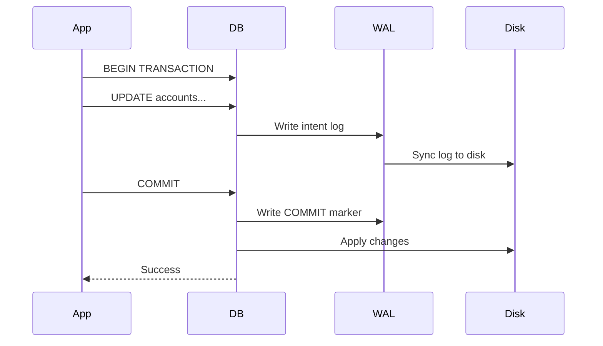
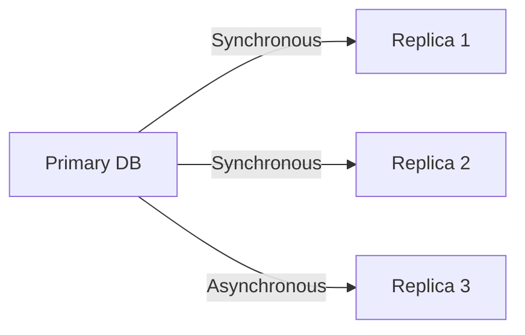
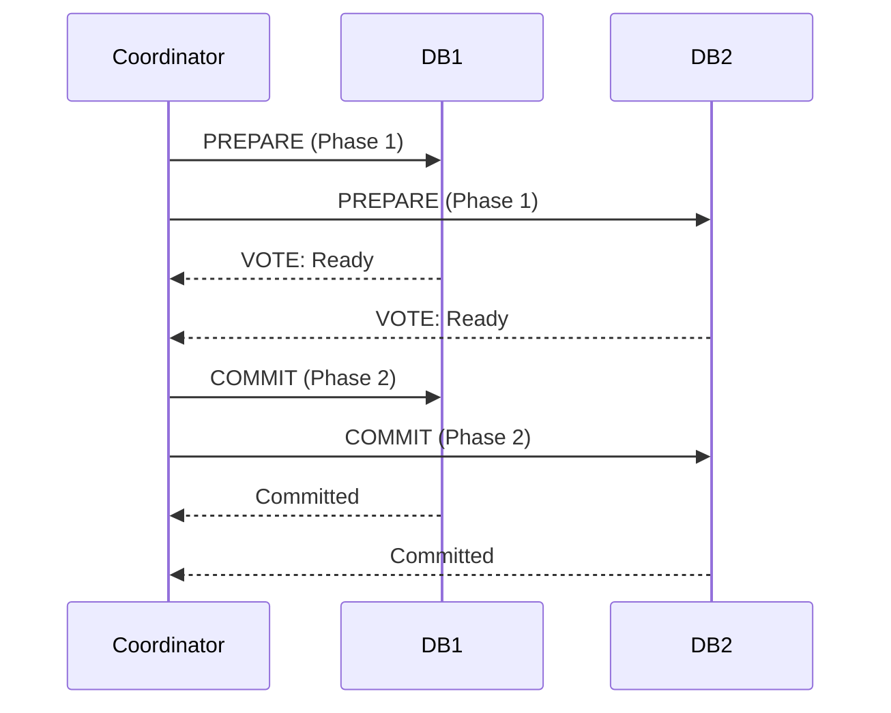

# ACID Properties: Guaranteeing Data Integrity

## Table of Contents
- [The Transaction Problem](#the-transaction-problem)
- [Atomicity: All or Nothing](#atomicity-all-or-nothing)
- [Consistency: Rules Are Law](#consistency-rules-are-law)
- [Isolation: No Interference](#isolation-no-interference)
- [Durability: Permanent Changes](#durability-permanent-changes)
- [Implementation Mechanics](#implementation-mechanics)
- [Trade-offs and Performance](#trade-offs-and-performance)
- [ACID vs BASE](#acid-vs-base)

## The Transaction Problem

Imagine a bank transfer: $100 from Account A to Account B.

```sql
-- Step 1: Deduct from A
UPDATE accounts SET balance = balance - 100 WHERE id = 'A';

-- Step 2: Add to B
UPDATE accounts SET balance = balance + 100 WHERE id = 'B';
```

**What could go wrong?**
1. **Power failure** after Step 1 → Money disappears!
2. **Constraint violation** in Step 2 (B doesn't exist) → A loses money, B gains nothing
3. **Concurrent transfer** reading stale data → Race condition
4. **Database crash** before writing to disk → Changes lost

**Solution:** ACID guarantees

## Atomicity: All or Nothing

### Definition
A transaction is **indivisible**. Either ALL operations succeed, or ALL are rolled back.

### Example: Transfer Transaction

```sql
BEGIN TRANSACTION;

UPDATE accounts SET balance = balance - 100 WHERE id = 'A';
-- ⚡ CRASH HERE ⚡

UPDATE accounts SET balance = balance + 100 WHERE id = 'B';

COMMIT;
```

**Without Atomicity:**
- Account A: -$100
- Account B: +$0
- **$100 vanished**

**With Atomicity:**
- Database detects incomplete transaction
- **Automatic ROLLBACK**
- Account A: unchanged
- Account B: unchanged

### How It Works: Write-Ahead Log (WAL)



**Key Insight:** Log is written BEFORE data changes. On crash:
1. Read WAL
2. If COMMIT marker exists → redo changes
3. If no COMMIT → discard transaction

### Code Example: PostgreSQL

```sql
-- Atomicity in action
BEGIN;

INSERT INTO orders (id, user_id, total) VALUES (1, 42, 99.99);
INSERT INTO order_items (order_id, product_id, qty) VALUES (1, 'SKU123', 2);
UPDATE inventory SET stock = stock - 2 WHERE product_id = 'SKU123';

-- If ANY statement fails, ALL are rolled back
COMMIT;
```

```sql
-- Explicit rollback
BEGIN;
UPDATE accounts SET balance = balance - 100 WHERE id = 'A';

-- Check if valid
SELECT balance FROM accounts WHERE id = 'A';
-- If balance negative, abort:

ROLLBACK;  -- Undo the update
```

## Consistency: Rules Are Law

### Definition
Transactions move the database from one **valid state** to another. All constraints, cascades, triggers must be satisfied.

### Database Constraints

```sql
CREATE TABLE accounts (
    id VARCHAR(10) PRIMARY KEY,
    balance DECIMAL(10,2) CHECK (balance >= 0),  -- Cannot be negative
    owner_id INT REFERENCES users(id)            -- Must exist
);

CREATE TABLE orders (
    id SERIAL PRIMARY KEY,
    total DECIMAL(10,2) CHECK (total > 0)  -- Must be positive
);
```

### Example: Constraint Violation

```sql
BEGIN;

-- Account A has $50
UPDATE accounts SET balance = balance - 100 WHERE id = 'A';
-- This violates CHECK (balance >= 0)

COMMIT;
-- ❌ Transaction FAILS, automatic ROLLBACK
```

### Application-Level Consistency

Databases enforce **structural** consistency (types, foreign keys). Your code enforces **business logic** consistency:

```javascript
// Transfer logic
async function transfer(fromId, toId, amount) {
    const client = await pool.connect();
    
    try {
        await client.query('BEGIN');
        
        // Business rule: Check minimum balance
        const { rows } = await client.query(
            'SELECT balance FROM accounts WHERE id = $1',
            [fromId]
        );
        
        if (rows[0].balance - amount < 100) {
            throw new Error('Must maintain $100 minimum balance');
        }
        
        await client.query(
            'UPDATE accounts SET balance = balance - $1 WHERE id = $2',
            [amount, fromId]
        );
        
        await client.query(
            'UPDATE accounts SET balance = balance + $1 WHERE id = $2',
            [amount, toId]
        );
        
        await client.query('COMMIT');
    } catch (e) {
        await client.query('ROLLBACK');
        throw e;
    } finally {
        client.release();
    }
}
```

### Triggers for Consistency

```sql
-- Automatically log all balance changes
CREATE TRIGGER audit_balance_change
AFTER UPDATE ON accounts
FOR EACH ROW
EXECUTE FUNCTION log_balance_audit();

-- If trigger fails, transaction fails (consistency maintained)
```

## Isolation: No Interference

### Definition
Concurrent transactions appear to execute **serially**, as if they ran one after another.

### The Problem: Race Conditions

**Scenario:** Two users simultaneously transfer from the same account.

| Time | Transaction 1 (User A) | Transaction 2 (User B) |
|------|------------------------|------------------------|
| T1 | BEGIN | |
| T2 | READ balance: $500 | BEGIN |
| T3 | | READ balance: $500 |
| T4 | DEDUCT $300 | |
| T5 | | DEDUCT $400 |
| T6 | WRITE balance: $200 | |
| T7 | | WRITE balance: $100 |
| T8 | COMMIT | |
| T9 | | COMMIT |

**Result:** Final balance is $100 (should be -$200 or fail)

**Lost Update Problem:** Transaction 2 overwrote Transaction 1's changes.

### Isolation Levels

SQL defines 4 levels (from weakest to strongest):

#### 1. Read Uncommitted (No Isolation)
Transactions can read **uncommitted changes** from other transactions.

```sql
SET TRANSACTION ISOLATION LEVEL READ UNCOMMITTED;

-- T1: BEGIN
-- T1: UPDATE accounts SET balance = 999 WHERE id = 'A';
-- T2: SELECT balance FROM accounts WHERE id = 'A';  → Sees 999!
-- T1: ROLLBACK;  -- Oops, T2 read "dirty data"
```

**Problems:** Dirty Reads  
**Use Case:** Rarely. Approximate analytics where accuracy doesn't matter.

#### 2. Read Committed (Default in PostgreSQL, Oracle)
Only read **committed** data.

```sql
SET TRANSACTION ISOLATION LEVEL READ COMMITTED;

-- T1: BEGIN
-- T1: UPDATE accounts SET balance = 999 WHERE id = 'A';
-- T2: SELECT balance FROM accounts WHERE id = 'A';  → Sees OLD value (500)
-- T1: COMMIT;
-- T2: SELECT balance FROM accounts WHERE id = 'A';  → NOW sees 999
```

**Problems:** Non-Repeatable Reads (same query, different results)  
**Use Case:** Most web applications

#### 3. Repeatable Read (Default in MySQL InnoDB)
Ensures the same query returns the same results throughout a transaction.

```sql
SET TRANSACTION ISOLATION LEVEL REPEATABLE READ;

BEGIN;
SELECT balance FROM accounts WHERE id = 'A';  -- 500

-- (Another transaction updates and commits)

SELECT balance FROM accounts WHERE id = 'A';  -- Still 500 (snapshot isolation)
COMMIT;
```

**Problems:** Phantom Reads (new rows appearing)  
**Use Case:** Financial calculations, reports

#### 4. Serializable (Strictest)
Transactions execute as if they were serial (one after another).

```sql
SET TRANSACTION ISOLATION LEVEL SERIALIZABLE;

-- Prevents ALL concurrency anomalies
-- But significantly slower (locks/aborts)
```

**Problems:** Performance  
**Use Case:** Critical financial operations

### Implementation: Locks vs MVCC

#### Pessimistic Locking (Traditional)
```sql
BEGIN;
SELECT * FROM accounts WHERE id = 'A' FOR UPDATE;  -- Row-level lock
-- Other transactions WAIT until we COMMIT
UPDATE accounts SET balance = balance - 100 WHERE id = 'A';
COMMIT;  -- Lock released
```

#### Optimistic Locking (MVCC - Multi-Version Concurrency Control)
```sql
-- PostgreSQL approach: Each transaction sees a snapshot
BEGIN;  -- Snapshot taken at this moment
SELECT balance FROM accounts WHERE id = 'A';  -- Read version 5
-- (Another transaction commits version 6)
SELECT balance FROM accounts WHERE id = 'A';  -- Still read version 5!
COMMIT;
```

**Advantages of MVCC:**
- Readers don't block writers
- Writers don't block readers
- Better concurrency

## Durability: Permanent Changes

### Definition
Once a transaction **commits**, changes are **permanent**—surviving crashes, power failures, and disasters.

### How It's Guaranteed

#### 1. Write-Ahead Logging (WAL)
```
Every change is written to LOG FIRST, then to data files.
```


**Why?** If crash occurs after C:
- WAL on disk has the changes
- On restart, replay WAL to reconstruct state

#### 2. Fsync
Ensures data is physically written to disk (not just OS buffer).

```c
// Simplified database write
write(wal_fd, transaction_data, size);
fsync(wal_fd);  // Block until physically written
return SUCCESS;
```

#### 3. Replication


**Synchronous Replication:** COMMIT only returns when replicas confirm write.  
**Asynchronous:** Faster, but small risk of data loss if primary fails.

### Configuration Trade-offs

```sql
-- PostgreSQL
ALTER SYSTEM SET synchronous_commit = off;  -- Faster, less durable
ALTER SYSTEM SET synchronous_commit = on;   -- Slower, fully durable
```

**Performance Impact:**
- `synchronous_commit = on`: ~500 TPS
- `synchronous_commit = off`: ~50,000 TPS

**Use Case for OFF:** Logging, analytics (losing 1 second of logs is acceptable)

## Implementation Mechanics

### Two-Phase Commit (2PC)
For distributed transactions across multiple databases.



**If ANY database votes NO or times out:**
- Coordinator sends ABORT to ALL
- Ensures atomicity across systems

**Problem:** Blocking protocol. If coordinator crashes after Phase 1, databases are stuck waiting.

### Saga Pattern (Modern Microservices)
Avoids distributed transactions. Uses compensating actions.

```javascript
// Distributed transaction: Book flight + hotel

async function bookTrip() {
    const flightId = await bookFlight();
    try {
        const hotelId = await bookHotel();
        return { flightId, hotelId };
    } catch (e) {
        // Compensating transaction
        await cancelFlight(flightId);
        throw e;
    }
}
```

## Trade-offs and Performance

### CAP Theorem Connection
In distributed systems, you can only guarantee 2 of 3:
- **C**onsistency
- **A**vailability
- **P**artition Tolerance

**Traditional ACID databases choose CP:** Strong consistency, but unavailable during network partitions.

### Performance Impact

| Level | Reads/sec | Writes/sec | Concurrency |
|-------|-----------|------------|-------------|
| Read Uncommitted | 100k | 50k | Highest |
| Read Committed | 80k | 40k | High |
| Repeatable Read | 60k | 30k | Medium |
| Serializable | 20k | 5k | Low |

### Optimization Techniques

```sql
-- Reduce lock contention
BEGIN;
-- Do reads first
SELECT ...;

-- Locks acquired as late as possible
UPDATE ...;
COMMIT;
```

```sql
-- Use optimistic locking for high-contention rows
UPDATE inventory 
SET stock = stock - 1, version = version + 1 
WHERE product_id = 'HOT_ITEM' AND version = 42;
-- If version changed, retry
```

## ACID vs BASE

| ACID | BASE |
|------|------|
| Strong Consistency | Eventual Consistency |
| Immediate | Basically Available |
| RDBMS (PostgreSQL) | NoSQL (Cassandra, DynamoDB) |
| Vertical Scaling | Horizontal Scaling |
| Bank transactions | Social media feeds |

**BASE:** **B**asically **A**vailable, **S**oft state, **E**ventual consistency

```javascript
// BASE example: Like counter
// User A likes post → Counter shows 100
// User B likes post → Counter *might* show 100 for a few seconds
// Eventually → Counter shows 101

// ACID would guarantee instant consistency but requires locking
```

## Real-World Examples

### E-commerce Checkout
```sql
BEGIN ISOLATION LEVEL SERIALIZABLE;

-- Check inventory
SELECT stock FROM inventory WHERE product_id = 'SHOE123' FOR UPDATE;

-- Deduct
UPDATE inventory SET stock = stock - 1 WHERE product_id = 'SHOE123';

-- Create order
INSERT INTO orders (user_id, total) VALUES (42, 99.99);

-- Charge card (external API - potential issue!)
-- If this fails, entire transaction rolls back

COMMIT;
```

**Problem:** External APIs (Stripe, PayPal) don't participate in DB transactions. Use **idempotency keys** and **compensating transactions**.

### Multi-Table Consistency
```sql
BEGIN;

-- Delete user
DELETE FROM users WHERE id = 42;

-- Cascading delete (foreign key ON DELETE CASCADE)
-- Automatically deletes from:
-- - user_profiles
-- - user_sessions  
-- - user_preferences

COMMIT;  -- Either ALL deleted or NONE
```

## Further Reading

- [PostgreSQL Transaction Isolation](https://www.postgresql.org/docs/current/transaction-iso.html)
- [MySQL InnoDB ACID Properties](https://dev.mysql.com/doc/refman/8.0/en/mysql-acid.html)
- [Designing Data-Intensive Applications (Chapter 7)](https://dataintensive.net/)
- [Jepsen: Testing Distributed Systems](https://jepsen.io/)

## Conclusion

ACID properties are the bedrock of reliable data systems. They transform fragile, error-prone operations into atomic, consistent, isolated, and durable guarantees. While NoSQL "BASE" systems trade some guarantees for scale, ACID remains essential for financial systems, e-commerce, and anywhere data integrity is non-negotiable. Understanding ACID isn't just about databases—it's about understanding what it means for software to be **correct**.
