# Big O Notation: The Language of Algorithm Analysis

## Table of Contents
- [Why Big O Matters](#why-big-o-matters)
- [Formal Definition](#formal-definition)
- [Common Time Complexities](#common-time-complexities)
- [Space Complexity](#space-complexity)
- [Analysis Techniques](#analysis-techniques)
- [Practical Examples](#practical-examples)
- [Common Patterns](#common-patterns)
- [When Big O Lies](#when-big-o-lies)

## Why Big O Matters

```javascript
// Algorithm A
function findDuplicate_A(arr) {
    for (let i = 0; i < arr.length; i++) {
        for (let j = i + 1; j < arr.length; j++) {
            if (arr[i] === arr[j]) return arr[i];
        }
    }
}

// Algorithm B
function findDuplicate_B(arr) {
    const seen = new Set();
    for (let num of arr) {
        if (seen.has(num)) return num;
        seen.add(num);
    }
}
```

**Input:** 1,000,000 elements

| Algorithm | Time Complexity | Actual Runtime |
|-----------|----------------|----------------|
| A (Nested loops) | $O(n^2)$ | ~11 hours |
| B (Hash set) | $O(n)$ | ~100 milliseconds |

**1,000,000x faster** isn't a typo. This is why Big O matters.

## Formal Definition

Big O describes the **worst-case** upper bound on growth rate.

### Mathematical Definition
$f(n) = O(g(n))$ means:

$$\exists c > 0, n_0 > 0 : \forall n \geq n_0, f(n) \leq c \cdot g(n)$$

**In English:** Beyond some point $n_0$, $f(n)$ is bounded above by $c \cdot g(n)$.

### Example
Prove $3n^2 + 5n + 2 = O(n^2)$:

$$3n^2 + 5n + 2 \leq 3n^2 + 5n^2 + 2n^2 = 10n^2$$

For $n \geq 1$, we have $f(n) \leq 10 \cdot n^2$, so $c = 10$, $n_0 = 1$.

### The Rules
1. **Drop constants:** $O(2n) = O(n)$
2. **Drop lower terms:** $O(n^2 + n) = O(n^2)$
3. **Different inputs get different variables:** $O(a + b)$ NOT $O(n)$

## Common Time Complexities

```mermaid
graph TB
    subgraph "Time Complexity Ranking"
        A["O(1) Constant<br/>⚡ Instant"]
        B["O(log n) Logarithmic<br/>🚀 Blazing Fast"]
        C["O(n) Linear<br/>✅ Good"]
        D["O(n log n) Linearithmic<br/>👍 Acceptable"]
        E["O(n²) Quadratic<br/>⚠️ Slow"]
        F["O(n³) Cubic<br/>🐌 Very Slow"]
        G["O(2ⁿ) Exponential<br/>💀 Intractable"]
        H["O(n!) Factorial<br/>☠️ Heat Death of Universe"]
    end
    
    A --> B --> C --> D --> E --> F --> G --> H
```



### $O(1)$ - Constant Time
**Description:** Execution time doesn't depend on input size.

```javascript
// Array access
function getFirst(arr) {
    return arr[0];  // O(1)
}

// Hash map lookup
function getValue(map, key) {
    return map.get(key);  // O(1) average
}

// Arithmetic
function add(a, b) {
    return a + b;  // O(1)
}
```

**Real-World:** Cache lookup, stack push/pop, array index access.

### $O(\log n)$ - Logarithmic Time
**Description:** Halves the problem with each step.

```javascript
// Binary search
function binarySearch(sorted, target) {
    let left = 0, right = sorted.length - 1;
    
    while (left <= right) {
        const mid = Math.floor((left + right) / 2);
        if (sorted[mid] === target) return mid;
        if (sorted[mid] < target) left = mid + 1;
        else right = mid - 1;
    }
    return -1;
}
```

**Growth:**
- $n = 1,000$: ~10 steps
- $n = 1,000,000$: ~20 steps
- $n = 1,000,000,000$: ~30 steps

**Real-World:** Binary search, balanced BST operations, finding in phone book.

### $O(n)$ - Linear Time
**Description:** Directly proportional to input size.

```javascript
// Linear search
function linearSearch(arr, target) {
    for (let i = 0; i < arr.length; i++) {
        if (arr[i] === target) return i;  // Worst case: scan entire array
    }
    return -1;
}

// Summing an array
function sum(arr) {
    let total = 0;
    for (let num of arr) total += num;
    return total;
}
```

**Real-World:** Iteration, copying arrays, finding max/min.

### $O(n \log n)$ - Linearithmic Time
**Description:** Standard for efficient sorting.

```javascript
// Merge sort
function mergeSort(arr) {
    if (arr.length <= 1) return arr;
    
    const mid = Math.floor(arr.length / 2);
    const left = mergeSort(arr.slice(0, mid));    // O(log n) divisions
    const right = mergeSort(arr.slice(mid));
    
    return merge(left, right);  // O(n) merge
}

// Quick sort (average case)
// Timsort (Python, Java default)
```

**Real-World:** Merge sort, quick sort (avg), heap sort.

### $O(n^2)$ - Quadratic Time
**Description:** Nested loops over input.

```javascript
// Bubble sort
function bubbleSort(arr) {
    for (let i = 0; i < arr.length; i++) {           // O(n)
        for (let j = 0; j < arr.length - i - 1; j++) {  // O(n)
            if (arr[j] > arr[j + 1]) {
                [arr[j], arr[j + 1]] = [arr[j + 1], arr[j]];
            }
        }
    }
    return arr;
}

// All pairs
function allPairs(arr) {
    for (let i = 0; i < arr.length; i++) {
        for (let j = i + 1; j < arr.length; j++) {
            console.log(arr[i], arr[j]);
        }
    }
}
```

**Real-World:** Bubble sort, insertion sort, comparing all pairs.

**Acceptable When:** $n < 1000$

### $O(2^n)$ - Exponential Time
**Description:** Doubles with each additional input.

```javascript
// Naive Fibonacci (recursive)
function fib(n) {
    if (n <= 1) return n;
    return fib(n - 1) + fib(n - 2);  // Branches exponentially
}

// Generates 2^n calls!
```

**Growth:**
- $n = 10$: 1,024 operations
- $n = 20$: 1,048,576 operations
- $n = 30$: 1,073,741,824 operations (1 billion!)
- $n = 50$: Longer than age of universe

**Real-World:** Brute-force password cracking, subset enumeration.

### $O(n!)$ - Factorial Time
**Description:** All permutations.

```javascript
// Traveling Salesman (brute force)
function tsp(cities) {
    const perms = getAllPermutations(cities);  // n! permutations
    let shortest = Infinity;
    
    for (let perm of perms) {
        const dist = calculateDistance(perm);
        shortest = Math.min(shortest, dist);
    }
    return shortest;
}
```

**Growth:**
- $n = 10$: 3,628,800
- $n = 20$: 2.4 × 10^18 (2.4 quintillion)

**Real-World:** Brute-force TSP, generating all arrangements.

## Space Complexity

Big O also describes **memory usage**.

```javascript
// O(1) space
function sum(arr) {
    let total = 0;  // Single variable
    for (let num of arr) total += num;
    return total;
}

// O(n) space
function duplicate(arr) {
    const copy = [...arr];  // New array of size n
    return copy;
}

// O(n) space (call stack)
function factorial(n) {
    if (n === 0) return 1;
    return n * factorial(n - 1);  // n recursive calls on stack
}
```

### Space-Time Trade-off

```javascript
// Fibonacci: Time O(2^n), Space O(n) - call stack
function fibRecursive(n) {
    if (n <= 1) return n;
    return fibRecursive(n - 1) + fibRecursive(n - 2);
}

// Fibonacci: Time O(n), Space O(n) - memoization
function fibMemo(n, memo = {}) {
    if (n <= 1) return n;
    if (memo[n]) return memo[n];
    memo[n] = fibMemo(n - 1, memo) + fibMemo(n - 2, memo);
    return memo[n];
}

// Fibonacci: Time O(n), Space O(1) - iterative
function fibIter(n) {
    let a = 0, b = 1;
    for (let i = 0; i < n; i++) {
        [a, b] = [b, a + b];
    }
    return a;
}
```

## Analysis Techniques

### 1. Count Operations in Loops

```javascript
function example1(n) {
    for (let i = 0; i < n; i++) {        // n iterations
        console.log(i);                   // O(1) each
    }
}
// Total: O(n)
```

```javascript
function example2(n) {
    for (let i = 0; i < n; i++) {        // n iterations
        for (let j = 0; j < n; j++) {    // n iterations
            console.log(i, j);            // O(1)
        }
    }
}
// Total: O(n²)
```

### 2. Different Inputs

```javascript
function example3(a, b) {
    for (let i = 0; i < a; i++) {        // a iterations
        console.log(i);
    }
    for (let j = 0; j < b; j++) {        // b iterations
        console.log(j);
    }
}
// Total: O(a + b)  NOT O(n)
```

### 3. Logarithmic Check

**If halving/doubling each step → $O(\log n)$**

```javascript
function logExample(n) {
    let i = 1;
    while (i < n) {
        console.log(i);
        i *= 2;  // Doubling: 1, 2, 4, 8, 16...
    }
}
// Runs log₂(n) times → O(log n)
```

### 4. Recursive Complexity

**Master Theorem:** For $T(n) = aT(n/b) + f(n)$:

```javascript
// Merge sort: T(n) = 2T(n/2) + O(n)
// a=2, b=2, f(n)=O(n) → O(n log n)

// Binary search: T(n) = T(n/2) + O(1)
// a=1, b=2, f(n)=O(1) → O(log n)
```

## Practical Examples

### Example 1: Finding Duplicates

```javascript
// O(n²) - Brute force
function hasDuplicates_Slow(arr) {
    for (let i = 0; i < arr.length; i++) {
        for (let j = i + 1; j < arr.length; j++) {
            if (arr[i] === arr[j]) return true;
        }
    }
    return false;
}

// O(n log n) - Sort first
function hasDuplicates_Medium(arr) {
    arr.sort((a, b) => a - b);  // O(n log n)
    for (let i = 0; i < arr.length - 1; i++) {  // O(n)
        if (arr[i] === arr[i + 1]) return true;
    }
    return false;
}

// O(n) - Hash Set
function hasDuplicates_Fast(arr) {
    const seen = new Set();
    for (let num of arr) {  // O(n)
        if (seen.has(num)) return true;  // O(1)
        seen.add(num);
    }
    return false;
}
```

### Example 2: Two Sum

```javascript
// O(n²) - Nested loops
function twoSum_Slow(arr, target) {
    for (let i = 0; i < arr.length; i++) {
        for (let j = i + 1; j < arr.length; j++) {
            if (arr[i] + arr[j] === target) {
                return [i, j];
            }
        }
    }
}

// O(n) - Hash Map
function twoSum_Fast(arr, target) {
    const map = new Map();
    for (let i = 0; i < arr.length; i++) {
        const complement = target - arr[i];
        if (map.has(complement)) {
            return [map.get(complement), i];
        }
        map.set(arr[i], i);
    }
}
```

## Common Patterns

### Pattern 1: Amortized Analysis

```javascript
// Dynamic Array (JavaScript Array.push)
// Individual push might be O(n) when resizing
// But amortized over many pushes: O(1)

const arr = [];
for (let i = 0; i < 1000000; i++) {
    arr.push(i);  // O(1) amortized
}
```

### Pattern 2: Best, Average, Worst Case

| Algorithm | Best | Average | Worst |
|-----------|------|---------|-------|
| Quick Sort | $O(n \log n)$ | $O(n \log n)$ | $O(n^2)$ |
| Binary Search | $O(1)$ | $O(\log n)$ | $O(\log n)$ |
| Linear Search | $O(1)$ | $O(n)$ | $O(n)$ |

**Big O** typically refers to **worst case**.

### Pattern 3: Data Structure Operations

| Data Structure | Access | Search | Insertion | Deletion |
|----------------|--------|--------|-----------|----------|
| Array | $O(1)$ | $O(n)$ | $O(n)$ | $O(n)$ |
| Linked List | $O(n)$ | $O(n)$ | $O(1)$ | $O(1)$ |
| Hash Table | N/A | $O(1)$ | $O(1)$ | $O(1)$ |
| Binary Search Tree | $O(\log n)$ | $O(\log n)$ | $O(\log n)$ | $O(\log n)$ |
| Heap | N/A | $O(n)$ | $O(\log n)$ | $O(\log n)$ |

## When Big O Lies

### 1. Hidden Constants

```javascript
// Both O(n), but very different in practice:

// Function A
function processA(arr) {
    for (let i = 0; i < arr.length; i++) {
        doQuickOperation(arr[i]);  // 1 nanosecond
    }
}

// Function B
function processB(arr) {
    for (let i = 0; i < arr.length; i++) {
        doExpensiveOperation(arr[i]);  // 1 millisecond
    }
}
```

$O(n)$ doesn't tell you that B is 1,000,000x slower!

### 2. Small Inputs

```javascript
// For n < 50, bubble sort (O(n²)) often faster than merge sort (O(n log n))
// Why? Lower constant factors, better cache locality, less overhead
```

### 3. Cache Effects

```javascript
// Iterating row-major (good cache locality)
for (let row = 0; row < n; row++) {
    for (let col = 0; col < n; col++) {
        matrix[row][col]++;  // Memory accessed sequentially
    }
}

// Iterating column-major (poor cache locality)
for (let col = 0; col < n; col++) {
    for (let row = 0; row < n; row++) {
        matrix[row][col]++;  // Memory hopping around
    }
}
// Same O(n²), but 2nd version can be 10x slower!
```

### 4. Real-World Systems

```javascript
// O(1) hash lookup... but:
// - Hash collision → O(n) worst case
// - Disk I/O → milliseconds
// - Network request → seconds
// - Cache miss → 100x slower than RAM
```

## Interview Tips

### 1. Clarify Input
```
"What's the typical size of n?"
n = 10 → Any algorithm works
n = 1,000,000 → Need O(n log n) or better
```

### 2. Explain Trade-offs
```
"I can solve this in O(n²) time and O(1) space, 
or O(n) time and O(n) space. Which is preferred?"
```

### 3. Optimize Progressively
```
1. Start with brute force: "The naive approach is O(n²)..."
2. Identify bottleneck: "The nested loop is the issue..."
3. Propose optimization: "Using a hash map reduces to O(n)..."
```

## Further Reading

- [Big-O Cheat Sheet](https://www.bigocheatsheet.com/)
- [Introduction to Algorithms (CLRS)](https://mitpress.mit.edu/books/introduction-algorithms-third-edition)
- [Grokking Algorithms](https://www.manning.com/books/grokking-algorithms)
- [Algorithm Visualizer](https://algorithm-visualizer.org/)

## Conclusion

Big O is the universal language for discussing algorithm efficiency. It abstracts away machine-specific details to focus on **scalability**: how runtime grows with input size. Mastering Big O isn't just about passing interviews—it's about building systems that work at scale, from databases processing billions of rows to web apps serving millions of users.
