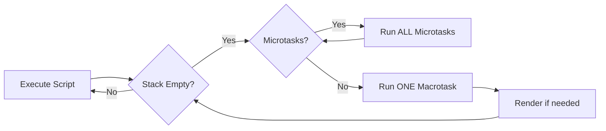

# The JavaScript Event Loop: Concurrency Without Threads

## Table of Contents
- [The Single-Threaded Reality](#the-single-threaded-reality)
- [Components of the Runtime](#components-of-the-runtime)
- [The Event Loop Mechanism](#the-event-loop-mechanism)
- [Task Queues Explained](#task-queues-explained)
- [Microtasks vs Macrotasks](#microtasks-vs-macrotasks)
- [Visual Examples](#visual-examples)
- [Common Patterns and Pitfalls](#common-patterns-and-pitfalls)
- [Performance Implications](#performance-implications)

## The Single-Threaded Reality

JavaScript runs on **a single thread**. This means:
- Only one piece of code executes at any given moment
- No parallel execution (unlike Java, Python with threads)
- Blocking operations would freeze the entire application

**The Question:** How can websites handle clicks, timers, network requests, and animations simultaneously without freezing?

**The Answer:** The Event Loop + Asynchronous APIs

## Components of the Runtime

```mermaid
graph TB
    subgraph "JavaScript Engine V8/SpiderMonkey"
        Heap[Memory Heap]
        Stack[Call Stack]
    end
    
    subgraph "Web APIs Browser/Node.js"
        Timer[setTimeout/setInterval]
        HTTP[fetch/XMLHttpRequest]
        DOM[DOM Events]
        Promise[Promise APIs]
    end
    
    subgraph "Task Infrastructure"
        Micro[Microtask Queue]
        Macro[Macrotask Queue]
        Loop[Event Loop]
    end
    
    Stack -->|Async call| Web APIs
    Timer --> Macro
    HTTP --> Macro
    DOM --> Macro
    Promise --> Micro
    Loop -->|Pop| Macro
    Loop -->|Pop| Micro
    Loop -->|Push| Stack
```

### 1. Call Stack
The execution context. LIFO (Last In, First Out) structure.

```javascript
function first() {
    second();
    console.log("First");
}

function second() {
    console.log("Second");
}

first();
```

**Stack Trace:**
```
1. → first() pushed
2.   → second() pushed
3.   → console.log("Second") pushed & executed & popped
4.   ← second() popped
5.   → console.log("First") pushed & executed & popped
6. ← first() popped
```

### 2. Web APIs
Browser-provided (or Node.js-provided) features that run **outside the JavaScript thread**:
- `setTimeout`, `setInterval`
- `fetch`, `XMLHttpRequest`
- DOM events (`click`, `scroll`)
- `requestAnimationFrame`

These handle the async work in parallel.

### 3. Callback Queues (Task Queues)
After Web APIs finish, they push callbacks to queues to wait for execution.

### 4. The Event Loop
A simple, infinite loop:
```javascript
while (true) {
    if (callStack.isEmpty()) {
        if (microtaskQueue.hasItems()) {
            microtaskQueue.pop().execute();
        } else if (macrotaskQueue.hasItems()) {
            macrotaskQueue.pop().execute();
        }
    }
}
```

It monitors the call stack and queues, moving tasks onto the stack when it's empty.

## The Event Loop Mechanism

### The Rules
1. **Execute synchronous code first** (everything on the call stack)
2. **When stack is empty**, check Microtask Queue
3. **Run ALL microtasks** until the queue is empty
4. **Then**, run ONE macrotask
5. **Repeat** from step 2

### Why This Order Matters
```javascript
console.log('1: Sync');

setTimeout(() => console.log('2: Macro'), 0);

Promise.resolve().then(() => console.log('3: Micro'));

console.log('4: Sync');

// Output:
// 1: Sync
// 4: Sync
// 3: Micro  ← Microtasks run first!
// 2: Macro
```

**Explanation:**
1. `console.log('1')` → Call Stack → Execute → Pop
2. `setTimeout` → Web API → Register callback in **Macrotask Queue**
3. `Promise.resolve().then` → Register callback in **Microtask Queue**
4. `console.log('4')` → Call Stack → Execute → Pop
5. **Stack Empty!** Event Loop checks:
   - Microtask Queue: Has `console.log('3')` → Execute
   - Macro task Queue: Has `console.log('2')` → Execute

## Task Queues Explained

### Macrotasks (Task Queue)
**Sources:**
- `setTimeout`
- `setInterval`
- `setImmediate` (Node.js)
- I/O operations
- UI rendering

**Behavior:** One macrotask per loop iteration

### Microtasks (Job Queue / Microtask Queue)
**Sources:**
- `Promise.then/catch/finally`
- `queueMicrotask()`
- `MutationObserver`
- `process.nextTick` (Node.js, even higher priority!)

**Behavior:** ALL microtasks run before next macrotask



## Microtasks vs Macrotasks

### The Critical Difference

```javascript
// Macrotask (setTimeout) - goes to back of line
setTimeout(() => console.log('Macro 1'), 0);
setTimeout(() => console.log('Macro 2'), 0);

// Microtask (Promise) - cuts in line!
Promise.resolve().then(() => console.log('Micro 1'));
Promise.resolve().then(() => console.log('Micro 2'));

console.log('Sync');

// Output:
// Sync
// Micro 1
// Micro 2
// Macro 1
// Macro 2
```

### Real-World Scenario: React State Updates

```javascript
function handleClick() {
    setState(new State());  // Schedules microtask
    console.log('Clicked');
}

// React batches updates using microtasks
// DOM updates before next macrotask (e.g.,setTimeout)
```

## Visual Examples

### Example 1: Nested Timers

```javascript
console.log('Start');

setTimeout(() => {
    console.log('Timeout 1');
    Promise.resolve().then(() => console.log('Promise in Timeout'));
}, 0);

setTimeout(() => {
    console.log('Timeout 2');
}, 0);

Promise.resolve()
    .then(() => console.log('Promise 1'))
    .then(() => console.log('Promise 2'));

console.log('End');

```

**Step-by-Step Execution:**
1. `console.log('Start')` → **Output: Start**
2. `setTimeout(Timeout 1)` → Macrotask Queue: `[Timeout 1]`
3. `setTimeout(Timeout 2)` → Macrotask Queue: `[Timeout 1, Timeout 2]`
4. `Promise.resolve().then(Promise 1)` → Microtask Queue: `[Promise 1]`
5. `console.log('End')` → **Output: End**
6. **Stack empty!** Event Loop runs:
   - Microtask: `Promise 1` → **Output: Promise 1** → Chains to `Promise 2` → Microtask Queue: `[Promise 2]`
   - Microtask: `Promise 2` → **Output: Promise 2**
   - Macrotask: `Timeout 1` → **Output: Timeout 1** → Encounters Promise → Microtask Queue: `[Promise in Timeout]`
   - Microtask: `Promise in Timeout` → **Output: Promise in Timeout**
   - Macrotask: `Timeout 2` → **Output: Timeout 2**

**Final Output:**
```
Start
End
Promise 1
Promise 2
Timeout 1
Promise in Timeout
Timeout 2
```

### Example 2: The Microtask Infinite Loop

```javascript
function blockEventLoop() {
    Promise.resolve().then(() => {
        console.log('Microtask');
        blockEventLoop();  // Schedules another microtask
    });
}

blockEventLoop();

setTimeout(() => console.log('I will NEVER run'), 0);
```

**What Happens:** The microtask queue NEVER empties, so the event loop NEVER gets to macrotasks. The timeout never executes. **The page freezes.**

**Lesson:** Be careful with recursive microtasks!

### Example 3: UI Responsiveness

```javascript
// BAD: Blocks the main thread
function slowSync() {
    for (let i = 0; i < 1e9; i++) {}  // 1 billion iterations
    console.log('Finally done');
}

button.addEventListener('click', slowSync);
// Click button → UI freezes for seconds
```

```javascript
// BETTER: Break work into chunks with setTimeout
function slowAsync(i = 0) {
    if (i < 1e9) {
        // Do a chunk of work
        processChunk(i, i + 1e6);
        setTimeout(() => slowAsync(i + 1e6), 0);  // Yield to event loop
    } else {
        console.log('Done');
    }
}

button.addEventListener('click', () => slowAsync());
// UI remains responsive!
```

## Common Patterns and Pitfalls

### Pattern 1: Debouncing with timers

```javascript
let timeout;
function debounce(fn, delay) {
    return function(...args) {
        clearTimeout(timeout);
        timeout = setTimeout(() => fn.apply(this, args), delay);
    };
}

// Use case: Search autocomplete
input.addEventListener('input', debounce(search, 300));
```

### Pattern 2: Promise Chains (Microtasks)

```javascript
fetch('/api/user')
    .then(res => res.json())          // Microtask 1
    .then(user => fetch(`/api/posts/${user.id}`))  // Microtask 2
    .then(res => res.json())          // Microtask 3
    .then(posts => render(posts));    // Microtask 4

// All THEN handlers queue as microtasks
// Run sequentially before next macrotask
```

### Pitfall 1: setTimeout is NOT Guaranteed Timing

```javascript
setTimeout(() => console.log('100ms later'), 100);

// If main thread is busy for 500ms...
for (let i = 0; i < 1e9; i++) {}  // Blocks for 500ms

// Callback runs after ~500ms, not 100ms!
```

`setTimeout` is a **minimum delay**, not exact timing.

### Pitfall 2: Starvation with Microtasks

```javascript
Promise.resolve().then(function repeat() {
    console.log('Micro');
    Promise.resolve().then(repeat);  // Infinite microtasks
});

// Macrotasks (setTimeout, UI events) starve
```

### Pitfall 3: Expecting Immediate DOM Updates

```javascript
element.textContent = 'Loading...';
heavyCalculation();  // Blocks thread
element.textContent = 'Done';

// User never sees "Loading..." because DOM renders during macrotask
// Both updates batched together
```

**Fix:**
```javascript
element.textContent = 'Loading...';
setTimeout(() => {
    heavyCalculation();
    element.textContent = 'Done';
}, 0);  // Let browser render "Loading..." first
```

## Performance Implications

### The 60 FPS Budget
Browsers aim for 60 frames per second = 16.67ms per frame.

**Frame Budget:**
- JavaScript execution: ~10ms
- Style calculations: ~2ms
- Layout: ~2ms
- Paint: ~2ms

If JavaScript runs for 20ms (or stalls on a long async operation), frames drop.

### Long Tasks
Chrome DevTools flags any task taking >50ms as a "Long Task."

**Monitoring:**
```javascript
const observer = new PerformanceObserver((list) => {
    for (const entry of list.getEntries()) {
        console.warn('Long Task detected:', entry.duration);
    }
});

observer.observe({ entryTypes: ['longtask'] });
```

### Breaking Up Work

```javascript
// BAD: Blocks thread
function processItems(items) {
    items.forEach(item => expensiveOperation(item));
}

// GOOD: Yield to event loop
async function processItems(items) {
    for (let item of items) {
        await processItem(item);
        await new Promise(resolve => setTimeout(resolve, 0));  // Yield
    }
}
```

## Node.js Differences

Node.js has additional queues:

1. **Timers**: `setTimeout`, `setInterval`
2. **Pending I/O Callbacks**: TCP errors, etc.
3. **Idle, Prepare**: Internal
4. **Poll**: Incoming connections, data
5. **Check**: `setImmediate`
6. **Close Callbacks**: `socket.on('close')`

### `setImmediate` vs `setTimeout(..., 0)`

```javascript
setTimeout(() => console.log('timeout'), 0);
setImmediate(() => console.log('immediate'));

// Output order is non-deterministic!
// Depends on where in the loop we are
```

**In I/O cycle:**
```javascript
fs.readFile('file.txt', () => {
    setTimeout(() => console.log('timeout'), 0);
    setImmediate(() => console.log('immediate'));
});

// Always:
// immediate
// timeout

// setImmediate is earlier in the loop than timers
```

### `process.nextTick` (Highest Priority!)

```javascript
Promise.resolve().then(() => console.log('promise'));
process.nextTick(() => console.log('nextTick'));

// Output:
// nextTick
// promise

// nextTick has even higher priority than microtasks!
```

## Debugging Tools

### Chrome DevTools Performance Tab
1. Record while reproducing issue
2. Look for long yellow/red bars (long tasks)
3. Identify blocking JavaScript

### `console.trace()`
```javascript
setTimeout(() => {
    console.trace('Where did this setTimeout come from?');
}, 1000);
```

### Visualizing the Event Loop
```javascript
function logEventLoop() {
    console.log('Sync');
    setTimeout(() => console.log('Macro'), 0);
    Promise.resolve().then(() => console.log('Micro'));
    queueMicrotask(() => console.log('QueuedMicro'));
}

logEventLoop();
```

## Further Reading

- [Jake Archibald's Event Loop Explanation](https://jakearchibald.com/2015/tasks-microtasks-queues-and-schedules/)
- [MDN: Concurrency Model and Event Loop](https://developer.mozilla.org/en-US/docs/Web/JavaScript/EventLoop)
- [Loupe: Visualizing the Event Loop](http://latentflip.com/loupe/)
- [Node.js Event Loop Guide](https://nodejs.org/en/docs/guides/event-loop-timers-and-nexttick/)

## Conclusion

The Event Loop is JavaScript's secret weapon. By delegating async work to Web APIs and carefully managing task queues, JavaScript achieves responsive, non-blocking behavior on a single thread. Understanding the microtask vs macrotask distinction is crucial for:
- Avoiding UI freezes
- Optimizing performance
- Debugging async behavior
- Writing correct async code

Master the Event Loop, and you master JavaScript concurrency.
