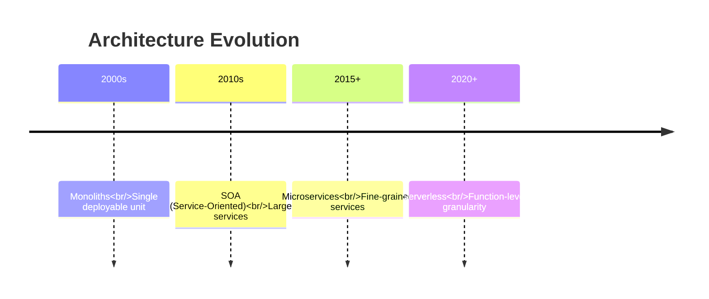
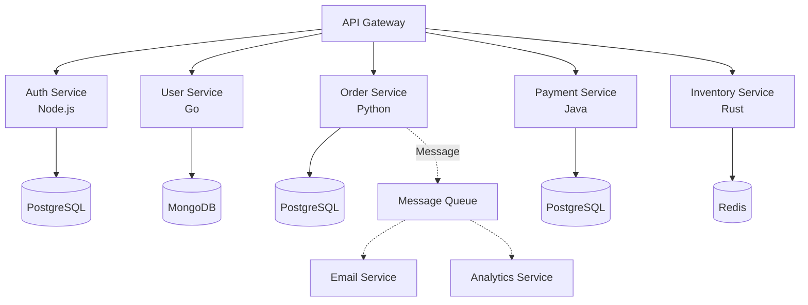
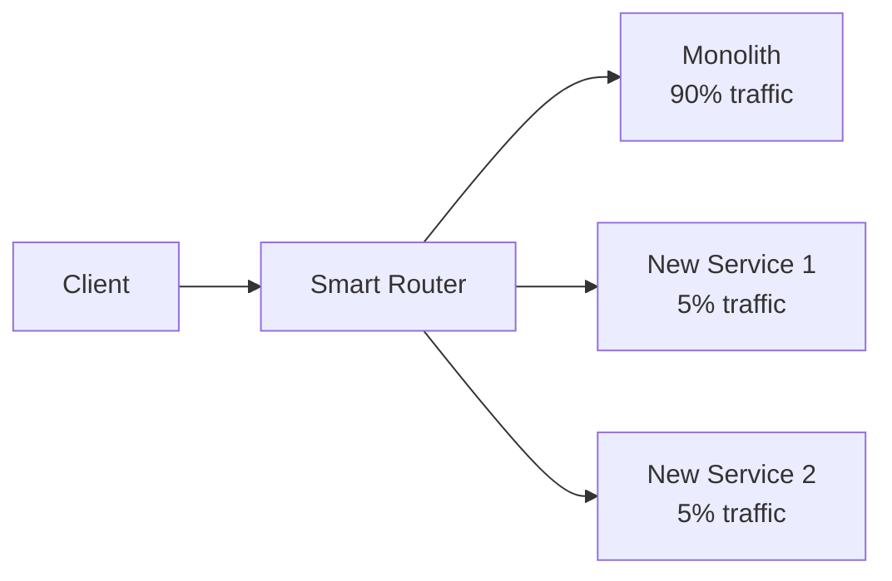

# Microservices vs Monoliths: The Great Divide

## Table of Contents
- [The Evolution](#the-evolution)
- [Monolithic Architecture](#monolithic-architecture)
- [Microservices Architecture](#microservices-architecture)
- [When to Choose Which](#when-to-choose-which)
- [Migration Strategies](#migration-strategies)
- [Communication Patterns](#communication-patterns)
- [Data Management](#data-management)
- [Observability and Debugging](#observability-and-debugging)

## The Evolution



## Monolithic Architecture

### Structure
```
my-app/
├── controllers/
├── services/
├── models/
├── views/
└── database/
```

Everything bundled into **one executable**, deployed as **one unit**.

### The Good Parts

#### 1. Simplicity
```bash
# Development
npm install
npm run dev

# Deployment
git push heroku main
# Done. One command.
```

No orchestration, no service discovery, no distributed tracing.

#### 2. Performance
```javascript
// Function call (nanoseconds)
const userService = new UserService();
const orderService = new OrderService();

const user = userService.getUser(userId);
const orders = orderService.getOrders(user.id);
// All in-memory, same process
```

No network latency. No serialization overhead.

#### 3. Easy Testing
```javascript
// Integration test
test('Place order flow', async () => {
    const user = await createUser();
    const product = await createProduct();
    const order = await placeOrder(user, product);
    
    expect(order.status).toBe('CONFIRMED');
    // Everything in same database, easy to verify
});
```

#### 4. ACID Transactions
```javascript
async function transferMoney(fromId, toId, amount) {
    return db.transaction(async (trx) => {
        await trx('accounts')
            .where({id: fromId})
            .decrement('balance', amount);
            
        await trx('accounts')
            .where({id: toId})
            .increment('balance', amount);
            
        await trx('audit_log').insert({
            from: fromId,
            to: toId,
            amount
        });
    });
    // All-or-nothing guarantee
}
```

### The Problems

#### 1. Scaling Inefficiency
```
Your app has:
- 90% simple CRUD (1 CPU core needed)
- 10% image processing (16 CPU cores needed)

Monolith: Must scale the ENTIRE app to 16 cores
Cost: $500/month

Microservices: Scale only image service to 16 cores
Cost: $150/month
```

#### 2. Technology Lock-in
```javascript
// Entire codebase is JavaScript
// Want to use Python for ML? Tough luck.
// Stuck with Express when FastAPI is better?
// Rewrite the entire app.
```

#### 3. Deployment Risk
```
Update one line in the checkout module?
Deploy the ENTIRE application.
If billing has a bug → Everything goes down.
```

#### 4. Team Coordination Hell
```
50 developers pushing to same repo
- Merge conflicts daily
- 2-hour builds
- "Who changed this function?"
- "Can't deploy, waiting for QA on unrelated feature"
```

### Real Example: Shopify's Monolith

**2004-2014:** Ruby on Rails monolith  
**Problems at scale:**
- 500k+ lines of code
- 45-minute deploy times
- Entire site down if one feature breaks
- Can't optimize checkout page without rebuilding admin panel

**Solution:** Gradual extraction to microservices (2015+)

## Microservices Architecture

### Structure


### The Good Parts

#### 1. Independent Scaling
```yaml
# Kubernetes deployment
services:
  auth:
    replicas: 2  # Low traffic
    cpu: 0.5
  
  order:
    replicas: 10  # Black Friday traffic
    cpu: 2
  
  payment:
    replicas: 5   # Medium traffic
    cpu: 1
```

Scale only what needs scaling. Cost-efficient.

#### 2. Technology Freedom
```
Auth Service     → Node.js      (Great for I/O)
ML Service       → Python       (Libraries)
Real-time Stats  → Go/Rust      (Performance)
Android App      → Kotlin       (Native)
Legacy System    → Java         (Don't touch it)
```

#### 3. Fault Isolation
```javascript
// Payment service crashes
// But users can still:
// - Browse products (Catalog service up)
// - Add to cart (Cart service up)
// - View orders (Order service up)

// Degraded mode, not total outage
if (paymentServiceDown) {
    return "Payment temporarily unavailable. Try again shortly.";
}
```

#### 4. Team Autonomy
```
Team A: Owns Checkout Service
- Choose their own tech stack
- Deploy independently
- Sprint planning independent
- Clear ownership

Team B: Owns Inventory Service
- Different language (Rust for speed)
- Different deploy schedule
- No coordination needed
```

#### 5. Continuous Deployment
```bash
# Deploy only what changed
git push payment-service
# Payment service deploys in 2 minutes
# Other services unaffected
```

Netflix deploys **4,000+ times per day**. Impossible with monolith.

### The Problems

#### 1. Distributed System Complexity
```javascript
// Simple user profile update in monolith:
await db.users.update({id: userId}, {email: newEmail});

// Same update in microservices:
1. API Gateway authenticates request
2. Calls User Service (HTTP request)
3. User Service validates
4. User Service calls Auth Service to update login
5. Auth Service calls Email Service to send confirmation
6. Email Service calls Notification Service
7. Update Analytics Service
8. Invalidate cache in CDN

// Any network call can fail:
- Timeout
- Service down
- Partial failure
- Network split
```

#### 2. Data Consistency is HARD
```javascript
// Monolith: ACID transaction
BEGIN;
INSERT INTO orders (user_id, total) VALUES (1, 99.99);
UPDATE inventory SET stock = stock - 1 WHERE product_id = 'ABC';
COMMIT;

// Microservices: Each service has own database!
// 1. Order Service inserts order ✅
// 2. Inventory Service crashes ❌
// Result: Order exists but inventory not decremented!

// Solution: Saga pattern (complex)
```

#### 3. Testing Nightmare
```javascript
// Integration test requires:
- Spinning up 10+ services
- Mocking external dependencies
- Setting up test databases for each service
- Coordinating message queues
- Managing test data across services

// vs Monolith: `npm test` and done
```

#### 4. Operational Overhead
```
Monolith:
- 1 application to monitor
- 1 log file to check
- 1 deployment pipeline

Microservices:
- 50+ applications to monitor
- Distributed tracing (Jaeger, Zipkin)
- Log aggregation (ELK stack)
- Service mesh (Istio, Linkerd)
- Container orchestration (Kubernetes)
- API Gateway
- Circuit breakers
- Load balancers

New role needed: DevOps/SRE team
```

#### 5. Latency
```
Monolith: Function call = 10 nanoseconds

Microservices:
- Serialize request to JSON: 0.1ms
- HTTP request: 5ms
- Deserialize: 0.1ms
- Database query: 10ms
- Serialize response: 0.1ms
- HTTP response: 5ms
Total: 20ms (2,000,000x slower!)

For complex flows (5 service calls): 100ms+
```

#### 6. Debugging is Hell
```
User reports: "Checkout failed"

In monolith:
- Check logs
- Find error in 30 seconds

In microservices:
- Which service failed?
- API Gateway logs say 500 error
- Check Order Service logs (nothing)
- Check Payment Service logs (timeout)
- Check Inventory Service logs (database connection pool exhausted)
- Turns out Analytics Service was DoS'ing the database
- Took 3 hours to debug across 5 services
```

## When to Choose Which

### Choose Monolith If:

✅ **Small team** (< 10 developers)  
✅ **MVP/Startup** (speed to market > scalability)  
✅ **Simple domain** (Blog, e-commerce store)  
✅ **Tight deadlines**  
✅ **Limited ops experience**

**Examples:** Most SaaS startups, internal tools, content sites

### Choose Microservices If:

✅ **Large team** (100+ developers)  
✅ **Mature product** (proven market fit)  
✅ **Complex domain** (Different scaling needs)  
✅ **Multiple languages needed** (ML + web + legacy)  
✅ **Have DevOps expertise**

**Examples:** Netflix, Amazon, Uber, Spotify

### The Spectrum (Not Binary!)


**Modular Monolith:** Single deployment, but well-structured modules (BEST OF BOTH WORLDS?)

```javascript
// Modules communicate via interfaces, not HTTP
import { OrderService } from '@modules/orders';
import { InventoryService } from '@modules/inventory';

// But can be extracted to microservices later if needed
```

## Migration Strategies

### Strangler Fig Pattern
Gradually replace parts of the monolith.



1. Identify a bounded context (e.g., "Payments")
2. Build new microservice
3. Route 1% of traffic to new service (canary)
4. Gradually increase to 100%
5. Delete old code from monolith
6. Repeat

**Time:** 2-5 years for large apps

### Branch by Abstraction
```javascript
// Old code
function placeOrder(order) {
    return MonolithOrderService.create(order);
}

// Step 1: Add abstraction
function placeOrder(order) {
    if (useNewService()) {
        return NewOrderMicroservice.create(order);
    }
    return MonolithOrderService.create(order);
}

// Step 2: Flip flag when confident
// Step 3: Delete old code
```

## Communication Patterns

### 1. Synchronous (HTTP/gRPC)
```javascript
// Order Service calls Inventory Service
const response = await fetch('http://inventory-service/api/check-stock', {
    method: 'POST',
    body: JSON.stringify({productId: 'SKU123', quantity: 2})
});

const stock = await response.json();
```

**Pros:** Simple, request-response  
**Cons:** Tight coupling, cascading failures

### 2. Asynchronous (Message Queue)
```javascript
// Order Service publishes event
await messageQueue.publish('order.placed', {
    orderId: '12345',
    items: [...]
});

// Inventory Service subscribes
messageQueue.subscribe('order.placed', async (event) => {
    await decrementStock(event.items);
});

// Email Service also subscribes
messageQueue.subscribe('order.placed', async (event) => {
    await sendConfirmationEmail(event.orderId);
});
```

**Pros:** Decoupling, resilience  
**Cons:** Complexity, eventual consistency

### 3. API Gateway Pattern
```javascript
// Mobile app makes 1 request
GET /api/dashboard

// API Gateway aggregates:
const [user, orders, recommendations] = await Promise.all([
    userService.getUser(userId),
    orderService.getOrders(userId),
    mlService.getRecommendations(userId)
]);

return {user, orders, recommendations};
```

## Data Management

### Database per Service
```
Each service owns its data. No shared database!

User Service → user_db
Order Service → order_db
Payment Service → payment_db
```

**Problem:** How to query across services?

```sql
-- Monolith: Easy JOIN
SELECT users.name, orders.total
FROM users
JOIN orders ON users.id = orders.user_id;

-- Microservices: Must make 2 API calls
const user = await userService.getUser(userId);
const orders = await orderService.getOrdersBy UserId(userId);
```

**Solutions:**
1. **API Composition:** App makes multiple calls
2. **CQRS:** Separate read and write models
3. **Event Sourcing:** Rebuild state from events

### Saga Pattern (Distributed Transactions)
```javascript
// Choreography: Services react to events
class OrderSaga {
    async handle() {
        try {
            const order = await orderService.create(orderData);
            
            await inventoryService.reserve(order.items);
            
            const payment = await paymentService.charge(order.total);
            
            await orderService.confirm(order.id);
        } catch (error) {
            // Compensating transactions (rollback)
            await inventoryService.release(order.items);
            await paymentService.refund(payment.id);
            await orderService.cancel(order.id);
        }
    }
}
```

## Observability and Debugging

### Distributed Tracing
```javascript
// Each request gets a unique trace ID
const trace = tracer.startTrace('place-order');

trace.addSpan('validate-cart');
await cartService.validate(cart);
trace.endSpan();

trace.addSpan('charge-payment');
await paymentService.charge(amount);
trace.endSpan();

trace.endTrace();
```

```
Trace ID: abc-123
├── API Gateway [10ms]
│   └── Order Service [50ms]
│       ├── Inventory Service [20ms]
│       ├── Payment Service [200ms] ⚠️ SLOW!
│       └── Email Service [30ms]
```

Tools: **Jaeger, Zipkin, Datadog APM**

### Centralized Logging
```
Log from ALL services → Elasticsearch
Query: "Show all errors in last hour"
```

Without this, you'd check 50+ log files manually.

## Advanced Patterns: Service Mesh & Serverless

### Service Mesh (Istio, Linkerd)
As the number of services grows, managing communication becomes a nightmare. A **Service Mesh** adds a dedicated infrastructure layer for handling service-to-service communication.

- **Sidecar Pattern:** A proxy (Envoy) sits next to each service container.
- **Features:**
    - **Traffic Management:** Canary releases, A/B testing.
    - **Security:** mTLS (Mutual TLS) between all services automatically.
    - **Observability:** Automatic metrics (latency, error rates) without code changes.

### Serverless Microservices (FaaS)
Instead of running services in containers (Docker/K8s), you can use functions (AWS Lambda, Google Cloud Functions).
- **Pros:** Zero infrastructure management, pay-per-request, infinite scaling.
- **Cons:** Cold starts, vendor lock-in, stateless limitation.
- **Use Case:** Event-driven tasks (image processing, webhooks).

## The Verdict

| Axis | Monolith | Microservices |
|------|----------|---------------|
| **Team Size** | < 20 | 50+ |
| **Time to MVP** | Weeks | Months |
| **Operational Complexity** | Low | High |
| **Scalability** | Vertical | Horizontal |
| **Tech Flexibility** | Low | High |
| **Deployment Speed** | Slow (big bang) | Fast (independent) |
| **Initial Cost** | Low | High (infrastructure) |
| **Debugging** | Easy | Hard |
| **Transaction Handling** | ACID | Eventual Consistency |

## Real-World Examples

### Amazon (Migrated 2001-2006)
**Before:** Monolithic Perl application  
**After:** Hundreds of microservices  
**Result:** Teams deploy independently, 1-second deploy

### Netflix
**Architecture:** 700+ microservices  
**Deploys:** 4,000/day  
**Scale:** 200M+ subscribers

### Shopify
**Architecture:** Modular monolith (hybrid)  
**Why:** Microservices complexity not worth it for their domain  
**Performance:** Handles Black Friday traffic (80k+ requests/sec)

## Further Reading

- [Martin Fowler: Microservices Guide](https://martinfowler.com/microservices/)
- [Sam Newman: Building Microservices](https://samnewman.io/books/building_microservices_2nd_edition/)
- [Microservices.io: Patterns](https://microservices.io/patterns/)
- [The Phoenix Project (Book)](https://itrevolution.com/product/the-phoenix-project/)

## Conclusion

**There is no silver bullet.** Microservices solve scaling and organizational problems but introduce distributed systems complexity. Most companies should start with a monolith and only migrate when the pain (slow deployments, scaling issues, team friction) outweighs the cost.

The best architecture is the **simplest one that meets your needs**. Don't build for Netflix scale if you have 100 users.
