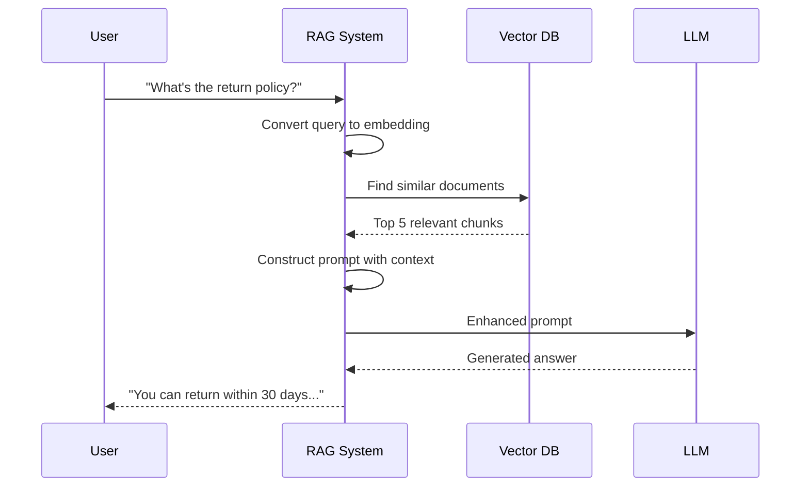
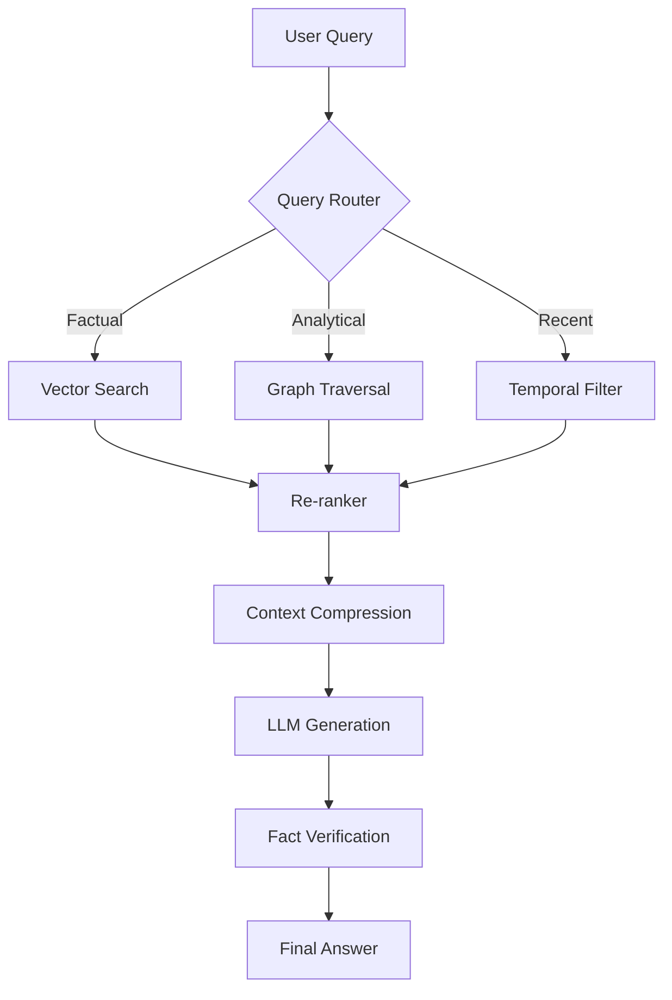

# Retrieval-Augmented Generation (RAG): The Knowledge Layer

## Table of Contents
- [The Core Problem](#the-core-problem)
- [How RAG Works](#how-rag-works)
- [Architecture Patterns](#architecture-patterns)
- [Implementation Guide](#implementation-guide)
- [Chunking Strategies](#chunking-strategies)
- [Retrieval Methods](#retrieval-methods)
- [Re-ranking and Filtering](#re-ranking-and-filtering)
- [Production Considerations](#production-considerations)
- [Advanced Techniques](#advanced-techniques)

## The Core Problem

Large Language Models have two fundamental limitations:

### 1. Knowledge Cutoff
```
User: "What happened in the 2024 Olympics?"
LLM: "I don't have information past April 2023."
```

The model is frozen at training time. New events are invisible.

###2. Hallucination
```
User: "What is our company's return policy?"
LLM: *makes up a plausible-sounding but completely wrong answer*
```

Models are trained to predict plausible text, not retrieve actual facts.

### The Traditional "Solution" (Doesn't Scale)
- **Fine-tuning**: Expensive ($10k+), slow (weeks), and you must retrain for every update
- **Prompt Stuffing**: Context windows are limited (even 128k tokens = ~300 pages)

## How RAG Works

RAG solves this elegantly: **Retrieve relevant documents → Inject into prompt → Generate answer**



### The Magic: Separation of Concerns
- **Retrieval**: Finding the right information (search problem)
- **Generation**: Synthesizing a coherent answer (language problem)

## Architecture Patterns

### 1. Naive RAG (Basic)
```
Query → Embedding → Vector Search → Top-K → Stuff in Prompt → LLM
```

**Pros:** Simple, fast  
**Cons:** No re-ranking, sensitive to chunking, can retrieve irrelevant docs

### 2. Advanced RAG
```
Query → Multi-Query Expansion → Hybrid Search → Re-rank → Context Compression → LLM
```

**Improvements:**
- Generate multiple query variations
- Combine vector search + keyword search (BM25)
- Re-rank results using a cross-encoder
- Compress retrieved chunks to fit context window

### 3. Modular RAG (Production)


## Implementation Guide

### Step 1: Document Ingestion

```python
from langchain.document_loaders import PyPDFLoader, UnstructuredMarkdownLoader
from langchain.text_splitter import RecursiveCharacterTextSplitter

# Load documents
loader = PyPDFLoader("company_policies.pdf")
documents = loader.load()

# Split into chunks
text_splitter = RecursiveCharacterTextSplitter(
    chunk_size=1000,  # Characters per chunk
    chunk_overlap=200,  # Overlap to preserve context across boundaries
    separators=["\n\n", "\n", ". ", " ", ""]  # Priority order
)
chunks = text_splitter.split_documents(documents)

print(f"Split {len(documents)} documents into {len(chunks)} chunks")
```

### Step 2: Generate Embeddings

```python
from langchain.embeddings import OpenAIEmbeddings
from langchain.vectorstores import Pinecone
import pinecone

# Initialize embedding model
embeddings = OpenAIEmbeddings(model="text-embedding-3-small")

# Initialize vector database
pinecone.init(api_key="your-api-key", environment="us-west1-gcp")
index_name = "company-knowledge"

# Create embeddings and store
vectorstore = Pinecone.from_documents(
    chunks,
    embeddings,
    index_name=index_name
)
```

### Step 3: Retrieval

```python
from langchain.retrievers import ContextualCompressionRetriever
from langchain.retrievers.document_compressors import LLMChainExtractor

# Basic retriever
base_retriever = vectorstore.as_retriever(
    search_type="mmr",  # Maximum Marginal Relevance (diversity)
    search_kwargs={
        "k": 10,  # Fetch 10 initial candidates
        "fetch_k": 50,  # From a pool of 50
        "lambda_mult": 0.7  # Diversity vs relevance trade-off
    }
)

# Add compression (remove irrelevant parts of retrieved docs)
compressor = LLMChainExtractor.from_llm(llm)
compression_retriever = ContextualCompressionRetriever(
    base_compressor=compressor,
    base_retriever=base_retriever
)

# Retrieve
query = "What is the return policy for electronics?"
relevant_docs = compression_retriever.get_relevant_documents(query)
```

### Step 4: Generation

```python
from langchain.chains import RetrievalQA
from langchain.chat_models import ChatOpenAI
from langchain.prompts import PromptTemplate

# Define prompt template
template = """You are a helpful customer service assistant. Use the following pieces of context to answer the question. If you cannot find the answer in the context, say "I don't have that information in our documentation."

Context:
{context}

Question: {question}

Answer: """

PROMPT = PromptTemplate(
    template=template,
    input_variables=["context", "question"]
)

# Create chain
llm = ChatOpenAI(model="gpt-4", temperature=0)
qa_chain = RetrievalQA.from_chain_type(
    llm=llm,
    chain_type="stuff",  # Stuff all docs into one prompt
    retriever=compression_retriever,
    chain_type_kwargs={"prompt": PROMPT},
    return_source_documents=True  # Include sources in response
)

# Query
result = qa_chain({"query": "What is the return policy for electronics?"})
print(result["result"])
print("\nSources:")
for doc in result["source_documents"]:
    print(f"- {doc.metadata['source']}, page {doc.metadata['page']}")
```

## Chunking Strategies

The most underrated part of RAG. Bad chunking = bad retrieval = bad answers.

### Strategy 1: Fixed-Size Chunks
```python
chunk_size=1000, chunk_overlap=200
```
**Pros:** Simple, uniform  
**Cons:** Breaks mid-sentence, loses context

### Strategy 2: Semantic Chunking
```python
from langchain.text_splitter import SemanticChunker

splitter = SemanticChunker(embeddings)
chunks = splitter.split_text(text)
```
Splits at natural semantic boundaries (topic changes detected via embedding similarity).

### Strategy 3: Recursive Hierarchical
```python
separators=["\n\n", "\n", ". ", " "]
```
Try to split on paragraphs first, then sentences, then words.

### Strategy 4: Document-Structure-Aware
```python
# For Markdown
separators=["# ", "## ", "### ", "\n\n", "\n"]

# For Code
separators=["\nclass ", "\ndef ", "\n\n", "\n"]
```

### Optimal Chunk Size by Use Case

| Use Case | Chunk Size | Reasoning |
|----------|------------|-----------|
| Q&A | 500-1000 chars | Small factoids |
| Summarization | 2000+ chars | Need more context |
| Code Search | 100-300 lines | Logical function boundaries |
| Legal Docs | 200-400 chars | Precise citations |

## Retrieval Methods

### 1. Dense Retrieval (Embeddings)
```python
query_embedding = embed_model.encode("return policy")
results = vector_db.similarity_search(query_embedding, k=5)
```

**Pros:** Captures semantic meaning ("laptop" ≈ "computer")  
**Cons:** Worse at exact keyword matching

### 2. Sparse Retrieval (BM25)
```python
from rank_bm25 import BM25Okapi

tokenized_corpus = [doc.split() for doc in corpus]
bm25 = BM25Okapi(tokenized_corpus)
scores = bm25.get_scores("return policy".split())
```

**Pros:** Great at exact matches, rare terms  
**Cons:** No semantic understanding

### 3. Hybrid Search (Best of Both)
```python
# Normalize scores to [0, 1], combine
alpha = 0.7  # Weight for dense
final_score = alpha * dense_score + (1 - alpha) * sparse_score
```

### 4. Parent Document Retrieval
Store small chunks (for precise matching) but retrieve their parent documents (for full context).

```python
from langchain.retrievers import ParentDocumentRetriever

parent_retriever = ParentDocumentRetriever(
    vectorstore=vectorstore,
    docstore=docstore,
    child_splitter=CharacterTextSplitter(chunk_size=400),
    parent_splitter=RecursiveCharacterTextSplitter(chunk_size=2000)
)
```

## Re-ranking and Filtering

After initial retrieval, improve precision:

### Cross-Encoder Re-ranking
```python
from sentence_transformers import CrossEncoder

model = CrossEncoder('cross-encoder/ms-marco-MiniLM-L-6-v2')

# Initial retrieval (cheap, fast)
candidates = vector_search(query, k=50)

# Re-rank (expensive, accurate)
pairs = [[query, doc.page_content] for doc in candidates]
scores = model.predict(pairs)

# Get top K after re-ranking
top_docs = [candidates[i] for i in scores.argsort()[-5:][::-1]]
```

### Metadata Filtering
```python
# Only search recent documents
retriever = vectorstore.as_retriever(
    search_kwargs={
        "filter": {"date": {"$gte": "2024-01-01"}},
        "k": 5
    }
)
```

### Self-Query Retrieval
Let the LLM extract filters from natural language:

```
User: "Show me Python tutorials from 2024"
LLM: {query: "Python tutorials", filter: {year: 2024, topic: "Python"}}
```

## Production Considerations

### 1. Caching
```python
from langchain.cache import RedisCache

# Cache embeddings (expensive to compute)
langchain.llm_cache = RedisCache(redis_url="redis://localhost:6379")
```

### 2. Monitoring
```python
import langsmith

# Track retrieval quality
with langsmith.trace(run_type="retrieval") as run:
    docs = retriever.get_relevant_documents(query)
    run.add_metadata({
        "num_docs": len(docs),
        "avg_score": sum(d.metadata["score"] for d in docs) / len(docs)
    })
```

### 3. Cost Optimization

| Component | Cost per 1M tokens | Alternatives |
|-----------|-------------------|--------------|
| OpenAI Embeddings | $0.13 | Sentence Transformers (free, local) |
| GPT-4 | $30 | GPT-3.5-turbo ($2), Llama-2 (free) |
| Pinecone | $70/month | pgvector (free, PostgreSQL) |

### 4. Latency Breakdown
```
Embedding generation:   50-100ms
Vector search:          10-50ms
Re-ranking (optional):  100-300ms
LLM generation:         2000-5000ms
-----------------------------------
Total:                  ~3-5 seconds
```

**Optimization:** Run embedding and search in parallel with user typing.

## Advanced Techniques

### 1. HyDE (Hypothetical Document Embeddings)
```python
# Generate a hypothetical answer first
hypothetical = llm("Answer this: " + query)

# Search using the hypothetical answer's embedding
results = vector_search(hypothetical)
```

**Why?** Queries ("what is X?") embed differently than answers ("X is..."). HyDE bridges this gap.

### 2. Query Decomposition
```python
# Break complex query into sub-queries
query = "Compare the return policies for laptops and phones"
sub_queries = [
    "What is the return policy for laptops?",
    "What is the return policy for phones?"
]
# Retrieve for each, then synthesize
```

### 3. Contextual Compression with LLM
```python
# Instead of returning raw chunks, have LLM extract only relevant sentences
for doc in retrieved_docs:
    prompt = f"Extract sentences relevant to '{query}' from:\n{doc}"
    compressed = llm(prompt)
```

### 4. Multi-Vector Retrieval
```python
# Create multiple embeddings per document (title, summary, full text)
# Retrieve using each, then merge
```

## Evaluation Metrics

### Retrieval Quality
- **Recall@K**: Did we retrieve the right documents?
- **MRR (Mean Reciprocal Rank)**: How high was the first relevant doc?
- **NDCG (Normalized Discounted Cumulative Gain)**: Weighted by position

### Generation Quality
- **Faithfulness**: Does the answer stay true to retrieved context?
- **Answer Relevancy**: Does it actually answer the question?
- **Context Relevancy**: Were the retrieved documents relevant?

### Ragas Framework
```python
from ragas import evaluate
from ragas.metrics import faithfulness, answer_relevancy

results = evaluate(
    dataset,
    metrics=[faithfulness, answer_relevancy]
)
print(results)
```

## Common Pitfalls

1. **Too Many Documents in Context**: Confuses the LLM ("lost in the middle" problem)
2. **No Source Citations**: Users can't verify answers. Always return sources
3. **Ignoring Metadata**: Dates, authors, categories are crucial for filtering
4. **One-Size-Fits-All Chunking**: Different docs need different strategies
5. **No Fallback**: What happens when no relevant docs are found?

## Real-World Use Cases

| Industry | Application | Key Requirement |
|----------|-------------|-----------------|
| Legal | Case Law Search | Precise citations, recency |
| Healthcare | Medical Literature | Accuracy, compliance |
| Customer Service | Policy Q&A | Low latency, multiple languages |
| E-commerce | Product Recommendations | Real-time updates |
| Software | Code Search | Syntax awareness |

## Further Reading

- [RAG Survey Paper (2023)](https://arxiv.org/abs/2312.10997)
- [LangChain RAG Tutorials](https://python.langchain.com/docs/use_cases/question_answering/)
- [Pinecone RAG Guide](https://www.pinecone.io/learn/retrieval-augmented-generation/)
- [Advanced RAG Techniques](https://blog.llamaindex.ai/advanced-rag-techniques-an-illustrated-overview-04d193d8fec6)

## Conclusion

RAG transformed LLMs from impressive but unreliable text generators into practical, trustworthy knowledge systems. By separating retrieval (finding facts) from generation (synthesizing answers), we get the best of both worlds: the fluency of language models with the accuracy of search engines. The key to success is in the details: chunking, retrieval, and re-ranking must all be tuned for your specific use case.
