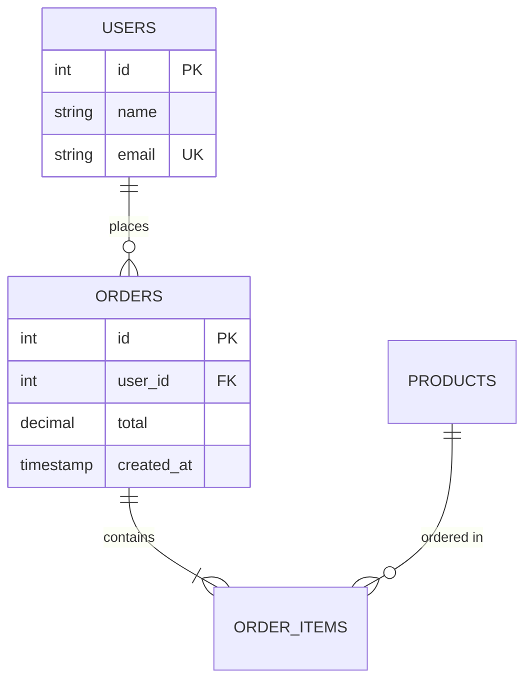

# SQL vs NoSQL: Database Paradigm Wars

## Table of Contents
- [The Fundamental Difference](#the-fundamental-difference)
- [SQL (Relational) Databases](#sql-relational-databases)
- [NoSQL Categories](#nosql-categories)
- [When to Use Each](#when-to-use-each)
- [Hybrid Approaches](#hybrid-approaches)
- [Migration Considerations](#migration-considerations)

## The Fundamental Difference

### SQL: Structure First
```sql
-- Schema MUST be defined upfront
CREATE TABLE users (
    id SERIAL PRIMARY KEY,
    name VARCHAR(100) NOT NULL,
    email VARCHAR(255) UNIQUE NOT NULL,
    created_at TIMESTAMP DEFAULT NOW()
);

-- Every row conforms to this structure
INSERT INTO users (name, email) 
VALUES ('Alice', 'alice@email.com');

-- Adding a field requires migration
ALTER TABLE users ADD COLUMN phone VARCHAR(20);
```

**Philosophy:** Data integrity through strict schemas and relationships.

### NoSQL: Flexibility First
```javascript
// No schema required
db.users.insertOne({
    name: "Alice",
    email: "alice@email.com",
    createdAt: new Date()
});

// Different structure? No problem.
db.users.insertOne({
    name: "Bob",
    email: "bob@email.com",
    phone: "+1234567890",
    address: {
        street: "123 Main St",
        city: "NYC"
    },
    tags: ["premium", "verified"]
});
```

**Philosophy:** Agility through schema-less design.

## SQL (Relational) Databases

### Core Principles

#### 1. Tables and Relationships


#### 2. ACID Transactions
```sql
BEGIN;

UPDATE accounts SET balance = balance - 100 WHERE id = 1;
UPDATE accounts SET balance = balance + 100 WHERE id = 2;

-- Both succeed or both fail
COMMIT;
```

#### 3. Powerful Queries (SQL)
```sql
-- Complex JOIN across 4 tables
SELECT 
    u.name,
    COUNT(o.id) as order_count,
    SUM(o.total) as lifetime_value,
    AVG(oi.quantity) as avg_items_per_order
FROM users u
LEFT JOIN orders o ON u.id = o.user_id
LEFT JOIN order_items oi ON o.id = oi.order_id
LEFT JOIN products p ON oi.product_id = p.id
WHERE u.created_at >= '2024-01-01'
GROUP BY u.id, u.name
HAVING COUNT(o.id) > 5
ORDER BY lifetime_value DESC
LIMIT 100;
```

### Popular SQL Databases

#### PostgreSQL
```sql
-- Advanced features
-- JSON support (hybrid!)
CREATE TABLE events (
    id SERIAL PRIMARY KEY,
    data JSONB NOT NULL
);

-- Full-text search
SELECT * FROM articles 
WHERE to_tsvector('english', content) @@ to_tsquery('database & optimization');

-- Window functions
SELECT 
    name,
    salary,
    AVG(salary) OVER (PARTITION BY department) as dept_avg
FROM employees;
```

**Use Case:** Complex queries, data integrity, general purpose

#### MySQL
```sql
-- High performance reads
-- Widely used in web

-- InnoDB: ACID compliance
-- MyISAM: Fast reads (no transactions)
```

**Use Case:** Web applications, WordPress, most SaaS products

#### Oracle/SQL Server
Enterprise features, expensive licensing, mission-critical systems.

### SQL Strengths

✅ **Data Integrity:**
- Foreign keys prevent orphaned records
- CHECK constraints enforce business rules
- Transactions ensure consistency

✅ **Complex Queries:**
- JOINs, subqueries, CTEs, window functions
- Aggregations across relationships
- Dynamic filtering

✅ **Mature Ecosystem:**
- 40+ years of development
- Extensive tooling
- Well-understood patterns

✅ **ACID Guarantees:**
Critical for financial, e-commerce, healthcare

### SQL Limitations

❌ **Rigid Schema:**
```sql
-- Want to add a field? Migration required.
ALTER TABLE users ADD COLUMN preferences JSONB;
-- Locks table during migration (downtime for large tables)
```

❌ **Vertical Scaling:**
```
Scaling up: Buy a bigger server ($$$)
Scaling out: Sharding is complex, loses JOIN capability
```

❌ **Object-Relational Mismatch:**
```javascript
// OOP: Nested objects
const user = {
    name: "Alice",
    address: {
        street: "123 Main",
        city: "NYC"
    }
};

// SQL: Flat tables, must JOIN
SELECT u.*, a.* FROM users u 
LEFT JOIN addresses a ON u.address_id = a.id;
```

## NoSQL Categories

### 1. Document Stores (MongoDB, Couchbase)

```javascript
// Flexible, JSON-like documents
db.products.insertOne({
    _id: "prod_123",
    name: "Laptop",
    price: 999,
    specs: {
        cpu: "Intel i7",
        ram: "16GB",
        storage: {
            type: "SSD",
            size: "512GB"
        }
    },
    tags: ["electronics", "computers"],
    reviews: [
        {author: "Alice", rating: 5, text: "Great!"}
    ]
});

// Query nested documents
db.products.find({
    "specs.ram": "16GB",
    "reviews.rating": {$gte: 4}
});
```

**Strengths:**
- Natural data modeling (matches app code)
- Flexible schema
- Embedded documents reduce JOINs

**Use Cases:** Content management, catalogs, user profiles

### 2. Key-Value Stores (Redis, DynamoDB)

```javascript
// Simple get/set
await redis.set("user:1000", JSON.stringify(userData));
const user = JSON.parse(await redis.get("user:1000"));

// TTL support
await redis.setex("session:abc", 3600, sessionData); // Expires in 1 hour

// Atomic operations
await redis.incr("page:views:homepage");
```

**Strengths:**
- Extremely fast (in-memory)
- Simple API
- Horizontal scaling

**Use Cases:** Caching, sessions, real-time counters

### 3. Column-Family (Cassandra, HBase)

```javascript
// Wide columns, optimized for writes
CREATE TABLE events (
    user_id UUID,
    timestamp TIMEUUID,
    event_type TEXT,
    data MAP<TEXT, TEXT>,
    PRIMARY KEY (user_id, timestamp)
);

// Writes are blazing fast (append-only)
// Reads by partition key are efficient
SELECT * FROM events WHERE user_id = 'uuid' AND timestamp > 'today';
```

**Strengths:**
- Massive write throughput
- Time-series data
- Horizontal scaling (petabytes)

**Use Cases:** IoT sensors, logs, analytics, Netflix viewing history

### 4. Graph Databases (Neo4j, Amazon Neptune)

```cypher
// Model relationships naturally
CREATE (alice:Person {name: 'Alice'})
CREATE (bob:Person {name: 'Bob'})
CREATE (charlie:Person {name: 'Charlie'})
CREATE (alice)-[:FRIENDS_WITH]->(bob)
CREATE (bob)-[:FRIENDS_WITH]->(charlie)

// Traverse relationships efficiently
MATCH (alice:Person {name: 'Alice'})-[:FRIENDS_WITH*1..3]-(friend)
RETURN friend.name;
// "Bob", "Charlie" (friends and friends-of-friends)
```

**Strengths:**
- Relationship queries (SQL JOINs become slow)
- Pathfinding, recommendations
- Social networks

**Use Cases:** Social graphs, fraud detection, knowledge graphs

## When to Use Each

### Use SQL When:

✅ **Data has clear structure and relationships**
```
E-commerce: Users → Orders → OrderItems → Products
Accounting: Invoices → LineItems → Taxes
```

✅ **Complex queries are common**
```sql
-- This is painful in NoSQL
SELECT 
    p.category,
    AVG(r.rating) as avg_rating,
    COUNT(DISTINCT o.user_id) as unique_buyers
FROM products p
JOIN order_items oi ON p.id = oi.product_id
JOIN orders o ON oi.order_id = o.id
LEFT JOIN reviews r ON p.id = r.product_id
GROUP BY p.category
HAVING avg_rating > 4.0;
```

✅ **Data integrity is critical**
```
Banking, Healthcare, Government
```

✅ **Team expertise**
```
SQL is a common skill. Finding devs is easier.
```

### Use NoSQL When:

✅ **Flexible schema needed**
```javascript
// User profiles vary wildly
{type: "influencer", followers: 1M, verified: true}
{type: "business", employees: 50, industry: "tech"}
{type: "individual", interests: ["coding", "gaming"]}
```

✅ **Horizontal scaling required**
```
100M+ users, petabytes of data
Can't fit on one server
```

✅ **High write throughput**
```
IoT: 10k events/second per device
Logs: Millions of log entries/minute
```

✅ **Simple access patterns**
```javascript
// Get by ID (key-value)
getUser(userId)

// No complex JOINs needed
```

## Real-World Hybrid Approaches

### PostgreSQL + Redis
```javascript
// PostgreSQL: Source of truth (ACID)
const user = await pg.query('SELECT * FROM users WHERE id = $1', [userId]);

// Redis: Cache hot data
await redis.setex(`user:${userId}`, 300, JSON.stringify(user));

// Read path
let user = await redis.get(`user:${userId}`);
if (!user) {
    user = await pg.query('SELECT * FROM users WHERE id = $1', [userId]);
    await redis.setex(`user:${userId}`, 300, JSON.stringify(user));
}
```

### MySQL + Elasticsearch
```javascript
// MySQL: Transactional data
await mysql.query('INSERT INTO products VALUES (?, ?, ?)', [id, name, price]);

// Elasticsearch: Full-text search
await es.index({
    index: 'products',
    id: productId,
    body: {
        name: name,
        description: description,
        tags: tags
    }
});

// Search in Elasticsearch, fetch details from MySQL
const searchResults = await es.search({query: "laptop"});
const ids = searchResults.hits.map(h => h._id);
const fullProducts = await mysql.query('SELECT * FROM products WHERE id IN (?)', [ids]);
```

### PostgreSQL with JSONB (Hybrid Column)
```sql
-- Relational structure + flexible data
CREATE TABLE users (
    id SERIAL PRIMARY KEY,
    email VARCHAR(255) UNIQUE NOT NULL,
    metadata JSONB  -- NoSQL-like flexibility
);

-- Strong schema + dynamic fields
INSERT INTO users (email, metadata) VALUES 
    ('alice@example.com', '{"preferences": {"theme": "dark"}, "badges": ["verified"]}');

-- Query JSON with SQL
SELECT * FROM users 
WHERE metadata->>'preferences'->>'theme' = 'dark';

-- Index JSON fields
CREATE INDEX idx_user_theme ON users ((metadata->'preferences'->>'theme'));
```

**Best of both worlds?** Maybe. Common in modern apps.

## Migration Considerations

### SQL → NoSQL

**Reasons:**
- Scaling limits hit
- Schema changes too frequent
- Need horizontal scaling

**Challenges:**
```javascript
// Lost: Foreign key constraints
// Before (SQL):
DELETE FROM users WHERE id = 1;
// Cascading delete removes all orders automatically

// After (NoSQL):
await db.users.deleteOne({_id: 1});
await db.orders.deleteMany({userId: 1});  // Manual cleanup!
```

**Strategy:** Dual-write during migration
```javascript
async function createUser(userData) {
    // Write to both databases
    const pgUser = await pg.query('INSERT INTO users...', userData);
    const mongoUser = await mongo.users.insertOne(userData);
    
    // Compare results for validation
    validate(pgUser, mongoUser);
    
    // Eventually switch reads to NoSQL
}
```

### NoSQL → SQL

**Reasons:**
- Data integrity issues piling up
- Complex queries needed
- Regulatory compliance (GDPR, HIPAA)

**Challenges:**
```javascript
// Before (Flexible):
{
    user: "Alice",
    orderDate: "2024-01-15",
    items: [
        {name: "Laptop", price: 999},
        {name: "Mouse", price: 25}
    ]
}

// After (Normalized):
users: {id: 1, name: "Alice"}
orders: {id: 1, user_id: 1, order_date: "2024-01-15"}
order_items: [
    {id: 1, order_id: 1, name: "Laptop", price: 999},
    {id: 2, order_id: 1, name: "Mouse", price: 25}
]
```

## Performance Comparison

| Operation | PostgreSQL | MongoDB | Redis | Cassandra |
|-----------|-----------|---------|-------|-----------|
| Simple Read | 10k/sec | 50k/sec | 100k/sec | 30k/sec |
| Simple Write | 5k/sec | 50k/sec | 100k/sec | 200k/sec |
| Complex JOIN | ✅ Fast | ❌ Slow | ❌ N/A | ❌ N/A |
| Horizontal Scale | ❌ Hard | ✅ Easy | ✅ Easy | ✅ Easy |
| Data Integrity | ✅ ACID | ⚠️ Eventual | ❌ No guarantees | ⚠️ Tunable |

## The Verdict

**There is no winner.** Choose based on:

1. **Data shape:** Relational? SQL. Hierarchical/Flexible? NoSQL.
2. **Query complexity:** Complex analytics? SQL. Simple lookups? NoSQL.
3. **Scale needs:** Vertical limit? NoSQL. Moderate? SQL fine.
4. **Consistency requirements:** Banking? SQL (ACID). Social feed? NoSQL (eventual OK).
5. **Team expertise:** SQL skills more common.

**Most companies:** Use **BOTH** (e.g., Postgres + Redis).

## Further Reading

- [Designing Data-Intensive Applications](https://dataintensive.net/)
- [MongoDB vs PostgreSQL](https://www.postgresql.org/about/news/mongodb-vs-postgresql-2189/)
- [Use The Index, Luke!](https://use-the-index-luke.com/)
- [Database Internals (Book)](https://www.databass.dev/)

## Conclusion

SQL and NoSQL aren't enemies—they solve different problems. SQL excels at structured data, complex queries, and strong consistency. NoSQL wins at flexible schemas, horizontal scaling, and specific use cases (caching, time-series, graphs). Modern applications often use multiple databases, each specialized for its task. The key is understanding trade-offs and choosing the right tool for each job.
