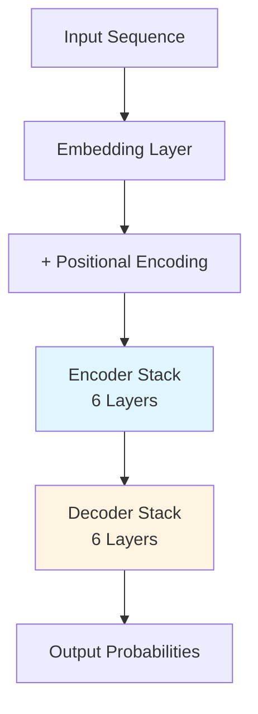
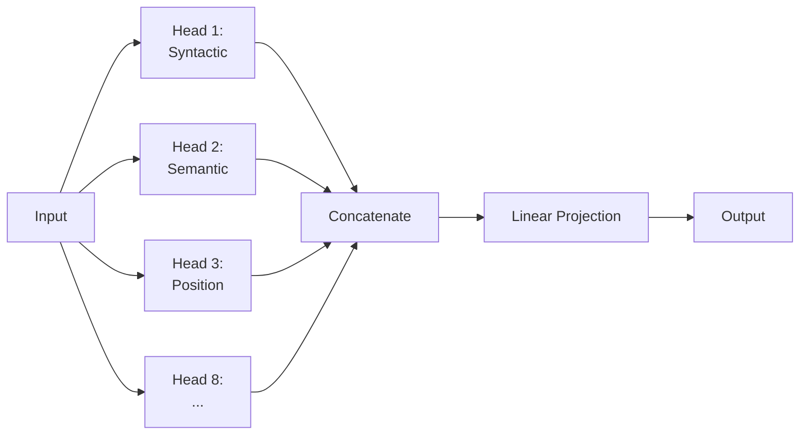

# Transformers: The Revolution in Deep Learning

## Table of Contents
- [Overview](#overview)
- [The Problem with RNNs](#the-problem-with-rnns)
- [Architecture Deep Dive](#architecture-deep-dive)
- [Self-Attention Mechanism](#self-attention-mechanism)
- [Multi-Head Attention](#multi-head-attention)
- [Positional Encoding](#positional-encoding)
- [Training and Applications](#training-and-applications)
- [Modern Variants](#modern-variants)
- [Code Implementation](#code-implementation)

## Overview

The **Transformer** architecture, introduced in the 2017 paper *"Attention Is All You Need"* by Vaswani et al., fundamentally changed how we approach sequence modeling. It replaced recurrence with pure attention mechanisms, enabling:

- **Parallel Processing**: Unlike RNNs that process sequentially, Transformers process entire sequences simultaneously
- **Long-Range Dependencies**: Captures relationships between distant tokens effortlessly
- **Scalability**: Trains efficiently on massive datasets with modern hardware

Today, virtually every state-of-the-art NLP model is Transformer-based: GPT-4, Claude, LLaMA, BERT, T5, and countless others.

## The Problem with RNNs

### Sequential Bottleneck
Recurrent Neural Networks (RNNs) and LSTMs process text one word at a time:
```
Input: "The cat sat on the mat"
Step 1: Process "The"
Step 2: Process "cat" (using state from Step 1)
Step 3: Process "sat" (using state from Step 2)
...
```

**Issues:**
- Cannot parallelize training (must wait for previous step)
- Gradient vanishing/explosion over long sequences
- Struggles with long-range dependencies

### The Breakthrough Insight
What if we could process ALL words simultaneously and let them "attend" to each other directly?

## Architecture Deep Dive

The original Transformer has two main components:



### Encoder Block
Each encoder layer contains:
1. **Multi-Head Self-Attention**: Allows each word to look at all other words
2. **Add & Norm**: Residual connection + Layer Normalization
3. **Feed-Forward Network**: Position-wise MLP
4. **Add & Norm**: Another residual connection

### Decoder Block
Each decoder layer adds:
- **Masked Self-Attention**: Prevents looking at future tokens (for autoregressive generation)
- **Cross-Attention**: Attends to encoder outputs

## Self-Attention Mechanism

The heart of the Transformer. For each word, it computes:

### The Formula
For each token $i$, we compute its representation by looking at ALL tokens:

$$\text{Attention}(Q, K, V) = \text{softmax}\left(\frac{QK^T}{\sqrt{d_k}}\right)V$$

Where:
- **Q** (Query): "What am I looking for?"
- **K** (Key): "What information do I have?"
- **V** (Value): "What information should I output?"

### Step-by-Step Example

**Input:** "The cat sat on the mat"

1. **Create Q, K, V**: For each word, we compute three vectors by multiplying the embedding by learned weight matrices $W_Q$, $W_K$, $W_V$.

2. **Compute Attention Scores**: For the word "cat", we calculate how much it should "attend to" every other word:
   ```
   cat · The = 0.1
   cat · cat = 1.0  (itself)
   cat · sat = 0.8  (strong relationship: the cat did the sitting)
   cat · on  = 0.2
   cat · the = 0.1
   cat · mat = 0.3  (weak relationship)
   ```

3. **Scale**: Divide by $\sqrt{d_k}$ to prevent dot products from getting too large

4. **Softmax**: Convert scores to probabilities summing to 1

5. **Weighted Sum**: Multiply each word's Value vector by its attention weight and sum

### Why It Works
This allows "cat" to dynamically gather context from "sat" (the action) without any recurrence or convolution.

## Multi-Head Attention

Instead of one attention mechanism, we use $h$ (typically 8 or 12) in parallel:



**Why?** Different heads learn different types of relationships:
- Head 1: Subject-verb agreement
- Head 2: Coreference resolution ("it" → "cat")
- Head 3: Positional relationships

## Positional Encoding

Since there's no recurrence, the model has no inherent sense of word order. We inject position information using sinusoidal functions:

$$PE_{(pos, 2i)} = \sin\left(\frac{pos}{10000^{2i/d}}\right)$$
$$PE_{(pos, 2i+1)} = \cos\left(\frac{pos}{10000^{2i/d}}\right)$$

These are added to the input embeddings. The sine/cosine pattern allows the model to learn relative positions.

## Training and Applications

### Pre-training (The Expensive Part)
Modern LLMs use **Causal Language Modeling**: predict the next token.
```
Input:  "The cat sat on"
Target: "cat sat on the"
```

This requires enormous compute:
- GPT-3: ~$4.6M in compute
- LLaMA-2 70B: 1.7M GPU hours

### Fine-tuning (The Cheap Part)
After pre-training, you can adapt the model to specific tasks with small datasets:
- Sentiment Analysis: 10k labeled examples
- Question Answering: SQuAD dataset
- Summarization: CNN/DailyMail dataset

## Modern Variants

### Encoder-Only (BERT)
```
[CLS] The cat sat [SEP]
  ↓     ↓   ↓   ↓
Classification, Token Classification
```
**Use Case**: Understanding tasks (classification, NER, search)

### Decoder-Only (GPT)
```
The → cat → sat → on → the → mat
```
**Use Case**: Generation tasks (chat, code, creative writing)

### Encoder-Decoder (T5, BART)
Full original architecture. Good for:
- Translation
- Summarization
- Text-to-text tasks

## Code Implementation

### Simplified Self-Attention in PyTorch

```python
import torch
import torch.nn as nn
import torch.nn.functional as F
import math

class SelfAttention(nn.Module):
    def __init__(self, embed_size, heads):
        super(SelfAttention, self).__init__()
        self.embed_size = embed_size
        self.heads = heads
        self.head_dim = embed_size // heads
        
        assert (self.head_dim * heads == embed_size), "Embed size must be divisible by heads"
        
        # Linear layers for Q, K, V
        self.values = nn.Linear(embed_size, embed_size, bias=False)
        self.keys = nn.Linear(embed_size, embed_size, bias=False)
        self.queries = nn.Linear(embed_size, embed_size, bias=False)
        self.fc_out = nn.Linear(embed_size, embed_size)
        
    def forward(self, values, keys, query, mask=None):
        N = query.shape[0]  # Batch size
        value_len, key_len, query_len = values.shape[1], keys.shape[1], query.shape[1]
        
        # Split embedding into self.heads pieces
        values = self.values(values).reshape(N, value_len, self.heads, self.head_dim)
        keys = self.keys(keys).reshape(N, key_len, self.heads, self.head_dim)
        queries = self.queries(query).reshape(N, query_len, self.heads, self.head_dim)
        
        # Scaled dot-product attention
        # queries shape: (N, query_len, heads, head_dim)
        # keys shape: (N, key_len, heads, head_dim)
        # energy shape: (N, heads, query_len, key_len)
        energy = torch.einsum("nqhd,nkhd->nhqk", [queries, keys])
        
        # Apply mask (for decoder to prevent looking ahead)
        if mask is not None:
            energy = energy.masked_fill(mask == 0, float("-1e20"))
        
        # Attention weights
        attention = torch.softmax(energy / (self.embed_size ** (1/2)), dim=3)
        
        # Weighted sum of values
        # attention shape: (N, heads, query_len, key_len)
        # values shape: (N, value_len, heads, head_dim)
        # out shape: (N, query_len, heads, head_dim)
        out = torch.einsum("nhql,nlhd->nqhd", [attention, values])
        
        # Concatenate heads
        out = out.reshape(N, query_len, self.heads * self.head_dim)
        
        return self.fc_out(out)

# Usage
embed_size = 512
heads = 8
seq_length = 100
batch_size = 32

attention = SelfAttention(embed_size, heads)
x = torch.randn(batch_size, seq_length, embed_size)
out = attention(x, x, x)  # Self-attention: Q, K, V all come from same source
print(out.shape)  # (32, 100, 512)
```

### Complete Transformer Block

```python
class TransformerBlock(nn.Module):
    def __init__(self, embed_size, heads, dropout, forward_expansion):
        super(TransformerBlock, self).__init__()
        self.attention = SelfAttention(embed_size, heads)
        self.norm1 = nn.LayerNorm(embed_size)
        self.norm2 = nn.LayerNorm(embed_size)
        
        self.feed_forward = nn.Sequential(
            nn.Linear(embed_size, forward_expansion * embed_size),
            nn.ReLU(),
            nn.Linear(forward_expansion * embed_size, embed_size)
        )
        self.dropout = nn.Dropout(dropout)
        
    def forward(self, value, key, query, mask):
        # Multi-head attention
        attention = self.attention(value, key, query, mask)
        
        # Add & Norm (Residual connection)
        x = self.dropout(self.norm1(attention + query))
        
        # Feed Forward
        forward = self.feed_forward(x)
        
        # Add & Norm (Residual connection)
        out = self.dropout(self.norm2(forward + x))
        return out
```

## Performance Characteristics

### Computational Complexity

| Model | Time Complexity | Space Complexity |
|-------|----------------|------------------|
| RNN | $O(n)$ | $O(n)$ |
| CNN | $O(1)$ | $O(n \cdot k)$ |
| Transformer | $O(n^2 \cdot d)$ | $O(n^2)$ |

Where:
- $n$ = sequence length
- $d$ = model dimension
- $k$ = kernel size

**The Quadratic Problem**: For long sequences (e.g., 100k tokens), the $O(n^2)$ becomes prohibitive. This spawned research into:
- **Sparse Attention**: Only attend to nearby tokens
- **Linear Attention**: Reformulate attention to be $O(n)$
- **Flash Attention**: Optimize memory access patterns

## Real-World Impact

### Before Transformers (2016)
- Machine Translation: BLEU score ~28
- Reading Comprehension: EM score ~70%
- Code Generation: Non-existent

### After Transformers (2024)
- Translation: Near-human parity (BLEU ~40+)
- Reading Comprehension: Superhuman (EM ~90%+)
- Code Generation: GitHub Copilot writes 40% of code

## Common Pitfalls

1. **Forgetting to Scale**: Always divide by $\sqrt{d_k}$ to prevent softmax saturation
2. **No Positional Encoding**: Model becomes order-invariant (treats as bag-of-words)
3. **Vanishing Gradients**: Use residual connections and proper initialization
4. **Memory Explosion**: $O(n^2)$ means 4x longer sequence = 16x more memory

## Further Reading

- [Original Paper: "Attention Is All You Need"](https://arxiv.org/abs/1706.03762)
- [The Illustrated Transformer](http://jalammar.github.io/illustrated-transformer/)
- [The Annotated Transformer](http://nlp.seas.harvard.edu/annotated-transformer/)
- [Hugging Face Transformers Documentation](https://huggingface.co/docs/transformers/)

## Conclusion

Transformers didn't just improve NLP—they unified it. The same architecture scales from 100M to 1T+ parameters, works on text, images, and audio, and powers everything from ChatGPT to GitHub Copilot. The attention mechanism's ability to model relationships without recurrence or locality bias makes it the most important architecture in modern AI.
